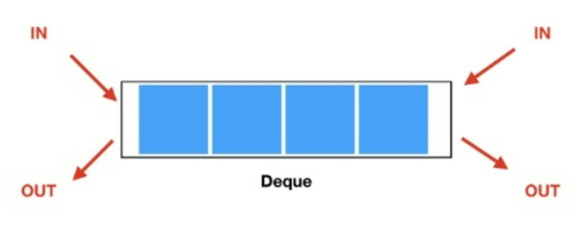

# 덱(Deque)

- Double-ended Queue의 약어이다.
- 큐의 변형된 형태(하위 유형)로, 양쪽 끝에서 삽입과 삭제가 모두 가능한 선형 자료구조이다.
- 덱은 큐와 스택의 특성을 모두 가지고 있으며, 큐의 선입선출(FIFO)과 스택의 후입선출(LIFO)을 모두 지원한다.
- Deque 인터페이스는 요소가 사용 가능해질 때까지 또는 큐에서 공간이 사용 가능해질 때까지 기다릴 수 있도록 하는 takeFirst 및 takeLast와 같은 차단 메소드를 제공한다. 
- 이는 동시 및 다중 스레드 애플리케이션에 적합한 선택이다.
- 덱은 순환 큐 또는 이중 연결 목록을 사용하여 구현할 수 있다. 
  - 덱의 순환 큐 구현은 양방향 큐를 구현하는 가장 간단한 접근 방식이다
    - 순환 큐 : 순환 링크를 형성하여 대기열의 마지막 노드를 첫 번째 노드에 연결한다는 점을 제외하고, 
      - 선입선출 원칙을 따르는 선형 대기열의 확장 버전.
      - 링버퍼(Ring Buffer)라고도 불린다. 
      - 순환 큐는 순환 링크로 인해 메모리를 효율적으로 관리한다
      - 이는 후면 포인터가 대기열의 최대 크기에 도달하면 다시 대기열의 시작 부분에 도착함을 의미한다. 
      - 후면 노드를 대기열의 시작 부분으로 가져오는 것을 순환 증분이라고 한다.


---
- 데이터를 양쪽 끝에서 삽입하거나 삭제할 수 있기 때문에, 양쪽에서 동시에 접근해야 하는 경우에 유용하다. 
- 예를 들어, 양방향으로 탐색해야 하는 그래프 알고리즘에서 덱을 사용하면 효율적인 탐색이 가능하다.
- 덱은 큐와 달리 크기가 동적으로 조정될 수 있다.
- 큐와 마찬가지로 배열이나 연결 리스트로 구현할 수 있다. 
- 큐와 덱은 각각의 특성에 따라 사용 상황에 맞게 선택하여 사용하면 된다.
- 덱의 삽입, 삭제 메서드의 시간 복잡도는 O(1)이다. 

---
## Method

- addLast() & addFirst() & addLast() : 덱에, 덱의 앞에, 덱의 뒤에 요소 추가
  - Deque의 용량이 제한되어 있고, 삽입 공간이 남아 있지 않으면 IllegalStateException 반환
  - 성공 시 true 반환
- offer(), offerFirst(), offerLast() : 덱에, 덱의 앞에, 덱의 뒤에 요소 추가
  - Container 용량이 가득 찼을 때도 예외를 발생시키지 않는다. 
  - false 반환
- peek(), peekFirst(), peekLast() : 덱에, 덱의 앞에, 덱의 뒤에 요소 확인. 
  - 요소를 제거하지 않는다. 
  - deque 비어 있으면 null 반환
- poll(), pollFirst(), pollLast() : 덱에, 덱의 앞에, 덱의 뒤에 요소 확인
  - 요소를 제거한다.
  - deque 비어 있으면 null 반환
- pop() : 덱의 헤드에서 요소를 제거하고 반환
- push() : 덱의 헤드에 요소를 추가
- removeFirst(), removeLast() : 덱의 헤드, 꼬리에서 요소 제거
- contains() : 덱에 요소 포함 여부 확인
- descendingIterator() : deque에 대한 반복자를 반환한다. 요소는 last - first 로 순서대로 반환된다.
- getFirst(), getLast() : 덱의 앞, 뒤 요소 확인. 제거하지 않는다.
- isEmpty() : 덱이 비어있는지 확인
- element() : 덱의 첫번 째 요소를 검색하며, 제거하지 않는다. 
- printDeque() : 덱을 출력
- size() : 덱의 크기 반환

---
```java
public class DequeExample {
    public static void main(String[] args) {
        Deque deque = new Deque();

        // 앞에 요소 추가
        deque.addFirst(10);
        deque.addFirst(20);

        // 뒤에 요소 추가
        deque.addLast(30);
        deque.addLast(40);

        // 덱 출력
        deque.printDeque(); // 20 10 30 40

        // 앞에서 요소 삭제
        System.out.println(deque.removeFirst()); // 20
        System.out.println(deque.removeFirst()); // 10

        // 뒤에서 요소 삭제
        System.out.println(deque.removeLast()); // 40

        // 덱이 비어있는지 확인
        System.out.println(deque.isEmpty()); // false
    }
}

class Deque {
    private Node head;
    private Node tail;

    public Deque() {
        this.head = null;
        this.tail = null;
    }

    // 앞에 요소 추가
    public void addFirst(int data) {
        Node newNode = new Node(data);

        if (head == null) {
            head = newNode;
            tail = newNode;
        } else {
            newNode.next = head;
            head.previous = newNode;
            head = newNode;
        }
    }

    // 뒤에 요소 추가
    public void addLast(int data) {
        Node newNode = new Node(data);

        if (tail == null) {
            head = newNode;
            tail = newNode;
        } else {
            newNode.previous = tail;
            tail.next = newNode;
            tail = newNode;
        }
    }

    // 앞에서 요소 삭제
    public int removeFirst() {
        if (isEmpty()) {
            throw new IllegalStateException("Deque is empty.");
        }

        int removedData = head.data;

        if (head == tail) {
            head = null;
            tail = null;
        } else {
            head = head.next;
            head.previous = null;
        }

        return removedData;
    }

    // 뒤에서 요소 삭제
    public int removeLast() {
        if (isEmpty()) {
            throw new IllegalStateException("Deque is empty.");
        }

        int removedData = tail.data;

        if (head == tail) {
            head = null;
            tail = null;
        } else {
            tail = tail.previous;
            tail.next = null;
        }

        return removedData;
    }

    // 덱이 비어있는지 확인
    public boolean isEmpty() {
        return (head == null && tail == null);
    }

    // 덱 출력
    public void printDeque() {
        Node current = head;
        while (current != null) {
            System.out.print(current.data + " ");
            current = current.next;
        }
        System.out.println();
    }
}

class Node {
    int data;
    Node previous;
    Node next;

    public Node(int data) {
        this.data = data;
        this.previous = null;
        this.next = null;
    }
}
```