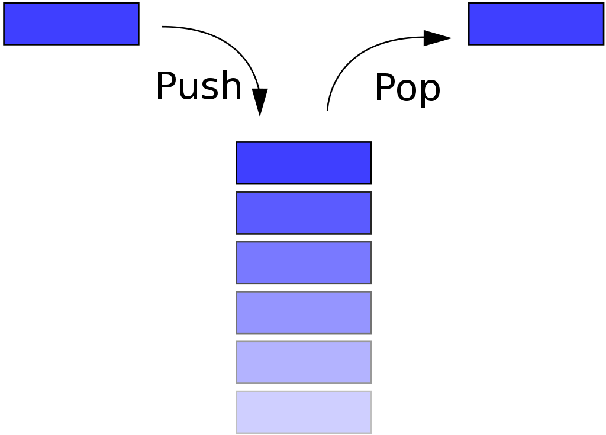

# 스택 / 큐 / 덱

### 스택(Stack)

- 데이터를 쌓아올린 형태의 자료구조
- 가장 마지막에 삽입된 자료가 가장 먼저 삭제되는 구조(Last In First Out)
- 정해진 방향으로만 쌓을 수 있으며, top으로 정한 곳을 통해서만 접근할 수 있다.


### 스택의 특징

- 후입선출(LIFO)의 구조로 먼저 들어온 데이터가 나중에 빠져나가는 구조이다.
- 단방향 입출력 구조 : 데이터의 들어오는 방향과 나가는 방향이 같다.
- 데이터를 하나씩만 넣고 뺄 수 있다.
- 깊이 우선 탐색(DFS)에 이용된다.
    - 루트노드에서 시작해서 다음 분기로 넘어가기 전에 해당 분기를 완벽하게 탐색하는 방법
    - 모든 노드를 방문하고자 할 때 사용

### 자바에서의 스택

```java
import java.util.Stack;

class Stack {
    public static void main(String[] args) {
        // Integer형 스택 선언
        Stack<Integer> stackInt = new Stack<>();
        // String형 스택 선언
        Stack<String> stackStr = new Stack<>();
        // Boolean형 스택 선언
        Stack<Boolean> stackBool = new Stack<>();

				// 값 추가 push()
				// 데이터를 스택에 추가하고, 해당 값을 반환한다.
        stackInt.push(1);
        stackInt.push(2);
        stackInt.push(3);
        // 1, 2, 3 순으로 값 추가

				// 스택의 마지막 요소 반환
				// 스택이 비어있을 경우 NoSuchElementException 예외 발생
				// 3 출력
				System.out.println(stackInt.peek());

        // 값 제거
			  // 스택의 값이 제거됨과 동시에 해당 값을 반환한다.
        stackInt.pop();
        stackInt.pop();
        stackInt.pop();
        // 3, 2, 1 순으로 값 제거

        // 값 추가 add()
        stackInt.add(1);
        stackInt.add(2);
        stackInt.add(3);
        // 1, 2, 3 순으로 값 추가

				// 스택에서 검색하여 해당 위치 반환 search()
				// 해당하는 값이 여러개일 경우 마지막 위치 반환
				// 해당하는 값이 없을 경우 -1 반환
				// 3 출
				System.out.println(stackInt.search(2));

        // 값 모두 제거
				// 반환값이 없다.
        stackInt.clear();

				// 스택이 비어있는지 여부 확인
				// true 출력
				System.out.println(stackInt.isEmpty());
    }
}

```

### 큐

- 선입선출 방식 사용 (First In First Out)
- 스택과 다르게 큐의 한쪽 끝에서는 삽입 작업이, 다른 한쪽에서는 삭제 작업이 나눠서 이뤄진다.
- 삭제 연산이 수행되는 곳을 Front, 삽입 연산이 이루어지는 곳은 Rear이다.
- 삽입 연산은 Enqueue라고 하고, 삭제 연산을 Dequeue라고 부른다.


### 자바에서의 큐

```jsx
import java.util.LinkedList;
import java.util.Queue;

class Queue{
Queue<Integer> queue = new LinkedList<>(); //int형 queue 선언, linkedlist 이용
Queue<String> queue = new LinkedList<>(); //String형 queue 선언, linkedlist 이용

// queue에 값 삽입
queue.add(1);     // queue에 값 1 추가
queue.add(2);     // queue에 값 2 추가
queue.offer(3);   // queue에 값 3 추가

}
```

### add()와 offer()의 차이

- 데이터 추가 시 큐에 빈 공간이 없을 때 add는 예외를 반환하고, offer는 false를 반환한다.
- poll과 peek는 null을 반환한다.

|  | 예외 | 값 리턴 |
| --- | --- | --- |
| 추가 | add(n) | offer(n) |
| 삭제 | remove() | poll() |
| 검사 | element() | peek() |

```java
import java.util.LinkedList;
import java.util.Queue;

class Queue{
// 연결리스트로 구현 시 큐의 길이를 쉽게 늘릴 수 있어 오버플로우가 발생하지 않는다.
Queue<Integer> queue = new LinkedList<>(); //int형 queue 선언, linkedlist 이용
Queue<String> queue = new LinkedList<>(); //String형 queue 선언, linkedlist 이용

// queue에 값 삽입
queue.add(1);      // queue에 값 1 추가
queue.add(2);      // queue에 값 2 추가
queue.offer(3);    // queue에 값 3 추가

// 값 삭제
queue.poll();       // queue에 첫번째 값을 반환하고 제거 비어있다면 null
queue.remove();     // queue에 첫번째 값 제거
queue.remove(3);    // queue에 해당 값이 존재하면 삭제 후 true/ 존재하지 않으면 galse
queue.clear();      // queue 초기화

// 큐의 front에 위치한 value 반환
queue.element();    // queue의 첫번째 값 반환 / 공백이면 예외 발생
queue.peek();       // queue의 첫번째 값 참조

// 큐의 크기 반환
queue.size();

// 큐에서 원소 찾기
queue.contains(3);  // true/false로 반환

// 공백 큐인지 확인
queue.isEmpty();    // true/false로 반환

}
```

### 덱

- 양쪽 끝에서 삽입과 삭제가 모두 가능
- 두 개의 포인터를 사용하여 양쪽에서 삭제와 삽입이 가능하다.
- 큐와 스택의 특성을 모두 갖고있다.


- Scroll : 입력 제한 덱(입력이 한쪽에서만 발생하고, 출력은 양쪽에서 일어난다.)
- Shelf : 출력 제한 덱(입력은 양쪽에서 일어나고, 출력은 한쪽에서만 일어난다.)

```java
import java.util.LinkedList;
import java.util.Queue;

class Deque{
	Deque<String> deque = new ArrayDeque<>();
	Deque<String> deque = new LinkedBlockingDeque<>();
	Deque<String> deque = new ConcurrentLinkedDeque<>();
	Deque<String> deque = new LinkedList<>();

	// 덱에 값 삽입
	deque.addFirst(); // Deque의 앞쪽에 데이터를 삽입, 용량 초과시 Exception
	deque.offerFirst(); //  Deque의 앞쪽에 데이터를 삽입 후 true, 용량 초과시 false
	deque.push(); // addFirst()와 동일
	
	deque.addLast(); // Deque의 뒤쪽에 데이터를 삽입, 용량 초과시 Exception
	deque.add(); // addLast()와 동일

	deque.offerLast(); //Deque의 뒤쪽에 데이터를 삽입 후 true, 용량 초과시 false
	deque.offer(); // offerLast()와 동일

	deque.removeFirst(); // Deque의 앞에서 제거, 비어있으면 예외
	deque.remove(); // removeFirst()와 동일
	deque.pop(); // removeFirst()와 동일

	deque.poll(); // Deque의 앞에서 제거, 비어있으면 null 리턴
	deque.pollFirst(); // poll()과 동일
	
	deque.removeLast(); // Deque의 뒤에서 제거, 비어있으면 예외
	deque.pollLast(); // Deque의 뒤에서 제거, 비어있으면 null 리턴

	// Deque의 앞쪽에서 찾아서 첫 번째 데이터를 삭제
	deque.removeFirstOccurrence(Object o);
	
	// Deque의 뒤쪽에서 찾아서 첫 번째 데이터를 삭제
	deque.removeLastOccurrence(Object o);
	
	// removeFirstOccurrence() 메소드와 동일
	deque.remove(Object o);

	deque.getFirst(); // 첫 번째 엘리먼트를 확인, 비어있으면 예외
	deque.peekFirst(); // 첫 번째 엘리먼트를 확인, 비어있으면 null 리턴
	deque.peek();// peekFirst()와 동일
	
	deque.getLast(); // 마지막 엘리먼트를 확인, 비어있으면 예외
	deque.peekLast();// 마지막 엘리먼트를 확인, 비어있으면 null 리턴
	
	deque.contain(Object o); // Object 인자와 동일한 엘리먼트가 포함되어 있는지 확인
	deque.size(); // Deque에 들어있는 엘리먼트의 개수

}
```