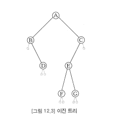
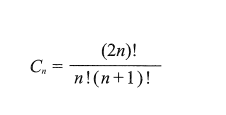
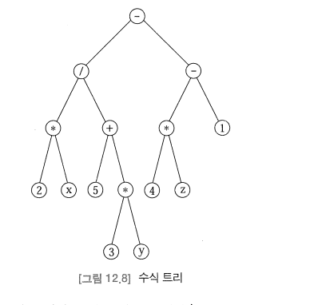
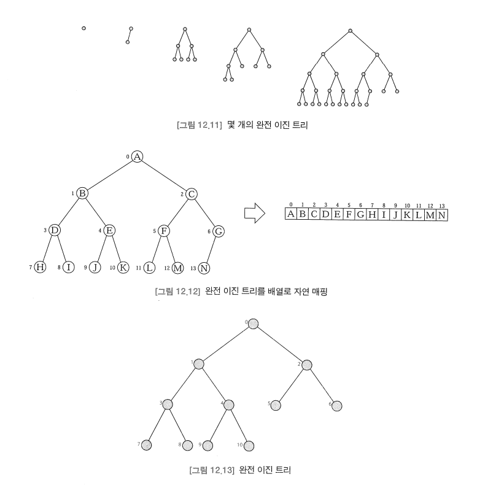
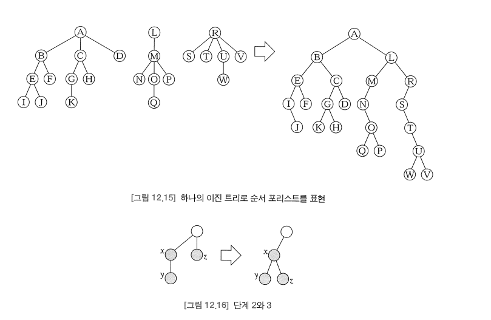

# 이진트리(Binary Tree)

- 이진 트리는 모든 내부 노드의 차수가 2인 순서 트리이다. 
  - => 모든 공백이 아닌 노드가 두 개의 서브트리를 가지는 순서 트리이다.
  - 이는 모든 내부 노드가 왼쪽 서브트리(left subtree)와 오른쪽 서브트리(right subtree)라고 부르는 두 개의 구별된 서브트리를 가지고 있음을 보장한다.
- 순서 트리로서 이진 트리는 다음과 같이 순환적으로 정의될 수 있다.
    > 이진 트리는 공집합이거나, x가 루트이고 L과 R은 둘 중 어떤 것도 x를 포함하지 않는 서로 분리된 이진 트리일 때, 삼원소 쌍(x, L, R)이다. 트리 L과 R을 루트 x의 왼쪽 서브트리와 오른쪽 서브트리라고 부른다.
- 순환 정의에 엄격하게 부합하기 위해서는 이진 트리의 모든 공백이 아닌 노드는 반드시 왼쪽 서브트리와 오른쪽 서브트리를 가져야 한다.
  - 이러한 서브 트리는 모두 공백일 수 있다. 
- 이진 트리의 리프는 왼쪽과 오른쪽 자식이 모두 NIL 노드(공백 트리)인 노드로 정의된다. 

## 이진 트리의 특성

### 포화 이진 트리의 크기
- 높이가 h인 포화 이진 트리의 크기 n은 n = 2h+1 - 1이다.
- 공백 트리는 높이가 h = -1인 포화 이진 트리로 취급되는데, 그 이유는 h가 -1이 되어야 이전 공식에서 n = 0이 되기 때문이다.
### 이진 트리의 크기에 대한 범위
- 높이가 h인 이진 트리의 크기 n은 h + 1 <= n <= 2h+1-1을 만족한다.
### 이진 트리의 높이
- 크기가 n인 공백이 아닌 이진 트리의 크기는 floor(log(n)) <= h를 만족한다.

## 이진 트리의 개수 세기
- 이진 트리의 개수는 카탈로니아 수를 따른다.

## 이진 트리 순회 알고리즘
- 이진 트리의 레벨 순서 순회, 전위 순회, 중위 순회, 후위 순회 알고리즘은 다음과 같다. 
  - 이진 트리의 레벨 순서 순회
    - 큐를 초기화한다
    - 루트를 큐에 삽입한다
    - 큐가 공백이 될 때까지 단계 4-7을 반복한다
    - 큐에서 첫 번째 노드 x를 삭제한다
    - x를 방문한다
    - 만일 x의 왼쪽 자식이 존재하면, 그것을 큐에 삽입한다
    - 만일 x의 오른쪽 자식이 존재하면, 그것을 큐에 삽입한다. 
  - 이진 트리의 순환 전위 순회
    - 루트를 방문한다
    - 만일 왼쪽 서브트리가 공백이 아니면, 그것에 대해 전위 순회를 수행한다. 
    - 만일 오른쪽 서브트리가 공백이 아니면, 그것에 대해 전위 순회를 수행한다. 
  - 이진 트리의 순환 후위 순회 
    - 만일 왼쪽 서브트리가 공백이 아니면, 그것에 대해 후위 순회를 수행한다 
    - 만일 오른쪽 서브트리가 공백이 아니면, 그것에 대해 후위 순회를 수행한다. 
    - 루트를 방문한다. 
  - 이진 트리의 순환 중위 순회
    - 만일 왼쪽 서브트리가 공백이 아니면, 그것에 대해 중위 순회를 수행한다.
    - 루트를 방문한다. 
    - 만일 오른쪽 서브트리가 공백이 아니면, 그것에 대해 중위 순회를 수행한다. 
- 접두사 전(pre), 중(in), 후(post)는 루트를 두 서브트리의 순회 이전(before), 중간(between), 이후(after)에 방문하는 것을 의미하고 있다. 

## 수식 트리

- 각각의 수식은 그것의 구조가 수식에 있는 연산자의 우선순위에 의해 결정되는 유일한 이진 트리에 의해 표현될 수 있다. 
- 이러한 트리는 수식 트리(expression tree)라고 부른다. 
  - 수식 트리의 생성
    - 만일 수식이 단일 피연산자이면, 그것을 포함하는 단독 트리를 리턴한다. 
    - E1과 E2가 수식이고, op가 연산자이면 E1 op E2로 수식을 공식화한다.
    - 수식 E1을 위한 수식 트리 T1을 얻을 수 있도록 이 알고리즘을 적용한다.
    - 수식 E2을 위한 수긱 트리 T2를 얻을 수 있도록 이 알고리즘을 적용한다.
    - 이진 트리 (op, T1, T2)를 리턴한다.

## 완전 이진 트리
- 각각의 완전 트리는 같은 크기를 가지는 배열로 자연 매핑된다. 
- 이진 트리는 순서 트리이므로, 동일한 자연 매핑이 정의된다. 
- 또한, 모든 포화 이진 트리는 완전 이진 트리이다. 

### 완전 이진 트리의 크기에 대한 범위
- 높이가 h인 완전 이진 트리의 크기 n은 2k <= n <= 2k+1 -1을 만족한다.

### 완전 이진 트리의 높이
- 크기가 n인 공백이 아닌 완전 이진 트리의 높이는 floor(h = log(n))이다.
- 완전 이진 트리의 자연 매핑은 루트를 0으로 하고, 트리의 레벨 순서 순회에 따라 트리의 노드에 순서대로 번호를 매기는 방법을 사용한다. 
- 자연 매핑의 한 가지 장점은 트리의 루트와 리프 사이를 수직적으로 이동하는 것이 간편해진다는 것이다. 

### 완전 이진 트리의 직렬화

- 이진 트리에서 노드 i의 부모 인덱스는 (i - 1) / 2이고, 자식은 2i + 1 과 2i + 2로 번호가 매겨져 있다. (정수 나눗셈 사용)
- 이러한 자연 매핑을 사용하면 루트 경로에 있는 어떤 노드의 인덱스도 쉽게 계산할 수 있다.
  - 어떤 리프로부터 루트까지 이동하는 것은 현재 인덱스 i를 (i - 1) / 2로 반복해서 교체하면 된다. 
  - 이와 유사하게, 루트로부터 리프까지 내려가는 것은 현재 인덱스 i를 2i + 1이나 2i + 2로 반복해서 교체하면 된다. 

### 완전 이진 트리에서 리프의 개수에 대한 범위
- 크기가 n인 완전 이진 트리에서 리프는 n/2 에서 n - 1까지 번호가 매겨진다. 

### 완전 이진 트리에서 내부 노드의 개수에 대한 범위 
- 완전 이진 트리는 n/2개의 내부 노드와 (n + 1) / 2개의 리프를 가지고 있다. 

## 포리스트
- 포리스트(forest)는 트리의 집합이고, 순서 포리스트(ordered forest)는 순서 트리의 시퀸스다.
  - 포리스트에 있는 개별적인 트리들이 이진 트리일 필요는 없다. 
- 순서 포리스트는 비교적 복잡한 구조를 가지고 있지만, 하나의 이진 트리로 유일하게 표현될 수 있다.

- 위 방식은 각 노드의 가장 나이가 많은 자식을 이진 트리에서 대응되는 노드의 왼쪽 자식으로 매핑시키고, 각 노드의 다음 형제를 이진 트리에서 대응되는 노드의 오른쪽 자식으로 매핑시키는 방법을 사용한다. 
    > 자연 매핑을 사용하여 포리스트를 이진 트리로 표현   
    >   1. 첫 번째 트리의 루트를 이진 트리의 루트로 매핑한다
    >   2. 만일 노드 y가 x의 첫 번째 자식이고 x가 x'으로 매핑된다면, y를 x'의 왼쪽 자식으로 매핑한다.
    >   3. 만일 노드 z가 x의 다음 형제라면 z를 x'의 오른쪽 자식으로 매핑한다.
- 순서 포리스트의 이진 트리 표현은 유일하다. 
  - 따라서 이진 트리로부터 원래의 순서 포리스트를 복원할 수 있다.
  - 즉, 자연 매핑은 일대일이다.