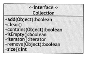

# 컬렉션(Collection)

- java.util 패키지가 제공하는 다양한 유형의 컬렉션들에 대한 인터페이스들과 클래스로, Java Collections Framework 라 칭한다.
- 계층 구조는 아래의 그림과 같다.
- 
- 컬렉션의 원소는 참조이며, 그 중 일부는 null이 될 수 있고, 그 중 여러 개는 동일 객체를 참조할 수 있다. 
- Collection 인터페이스의 구조는 다음과 같다.
- 
  - add() 메소드는 주어진 오브젝트가 컬렉션의 원소가 된다는 후조건을 가지고 있다.
    - 중복 원소를 허용하는 컬렉션의 경우 주어진 오브젝트가 추가되어 크기가 늘어난다.
    - 중복 원소를 허용하지 않는 컬렉션의 경우 주어진 오브젝트는 이미 존재하지 않을 경우에만 추가된다. 
    - 어떠한 경우든 컬렉션의 내용이 변경된 경우에 true 를 리턴한다.
  - clear() 메소드는 컬렉션의 모든 원소를 제거한다. 
    - 후조건은 컬렉션의 크기가 0이라는 것이다.
  - contains() 메소드는 참조된 오브젝트가 컬렉션의 멤버라는 것을 표시하기 위해 true 를 리턴한다.
    - 이는 이 컬렉션이 오브젝트와 x가 모두 null이 되거나, x.equals(object)가 true가 되는, 참조 x를 포함함을 의미한다.
  - isEmpty() 메소드는 컬렉션의 크기가 0일 때만 true를 리턴한다
  - iterator() 메소드는 컬렉션을 순회하기 위한 java.util.Iterator 객체를 리턴한다
  - remove(object) 메소드는 주어진 객체가 컬렉션에 포함되어 있으면 그 객체를 제거한다. 
    - add(object)와 마찬가지로 컬렉션이 변경된 경우에만 true를 리턴한다

## 반복자(Iterator)

- 해당 자료 구조 상에서 이동하면서 접근할 개개의 원소 위치를 나타내는 커서 또는 포인터 역할을 하는 객체이다.
- Collection 인터페이스의 iterator() 메소드는 인덱스가 배열을 순회하는 것과 같은 방식으로 컬렉션을 통해 순회하는 Iterator 객체를 리턴한다
- 반복자는 어떤 순간이든 컬렉션의 유일한 원소의 위치를 표시한다. 그 뒤 반복자의 메소드를 이용하여 해당 원소에 접근한다.
- 인터페이스 구조는 다음과 같다.
- 
  - hasNext() 메소드는 next() 메소드가 성공적으로 호출될 수 있는 경우에만 true를 리턴한다
    - 이 경우 반복자의 next() 메소드에 대한 다음 호출은 현재 위치의 원소를 리턴한다
  - next() 메소드는 현재 반복자가 가리키고 있는 원소에 대한 참조를 리턴하고, 반복자를 컬렉션의 다음 원소로 전진시킨다
    - 반복자가 원소를 방문하는 순서는 반복자 자체에 의해 결정된다. 
  - remove() 메소드는 next() 메소드에 대한 별도의 호출 후에만 작동한다.
    - next()에 대한 마지막 호출에 의해 리턴된 원소를 제거한다.
- Iterator 객체는 처음에 iterator() 메소드에 의해 호출될 때 컬렉션의 시작 위치로 초기화된다.

## AbstractCollection 클래스
- Collection 객체를 추상화한 클래스로, 
  - 인터페이스의 일반적인 구현을 위한, 
  - 특정 지원 자료 구조와 독립적으로 컴파일 될 수 있는, 
  - 모든 실행 가능 코드를 캡슐화시키는 
- 것을 목적으로 한다. 
- abstract 클래스를 사용함으로써 코드 중복성을 줄이며, 프레임워크를 좀 더 단순하고 관리하기 쉽도록 만들어준다. 
- AbstractCollection 클래스의 인터페이스 구조는 다음과 같다.
- 
- 대부분의 구체 메소드는 작업 수행을 위해 반복자를 사용한다. 