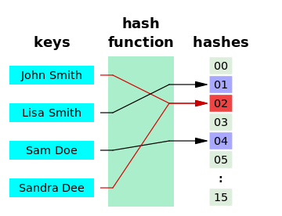

# HashMap

## HashMap이란

- 해싱(Hashing)된 맵으로 많은 양의 데이터를 검색하는데 있어서 뛰어난 성능을 가진다.
- 키(Key)와 값(Value)로 구성된 Entry 객체를 저장하는 구조를 가진다.
- 리스트나 배열처럼 순차적으로 요소를 구하지 않고 키(key)를 이용해 값(value)를 얻는다.

### 해싱과 해시함수



- 해싱 : 해시함수를 이용해서 데이터를 해시 테이블에 저장하고 검색하는 기법
- 해시함수 : 데이터가 저장되어 있는 곳을 알려주기 때문에 다량의 데이터 중에서도 원하는 데이터를 빠르게 검색
- HashMap과 같이 해싱을 구현한 컬렉션 클래스에서는 Object 클래스에 정의된 hashCode()를 해시함수로 사

### HashMap의 장점

- 빠른 검색 속도 : 해시 기법을 사용하여 대부분 O(1)의 시간복잡도를 가짐
- 빠른 삽입과 삭제
- 키-값 쌍 저장 : HashMap은 키(Key)와 값(value)의 쌍을 저장하기 때문에 데이터를 찾아 처리하는데 용이
- 동적 크기 조절 : 데이터의 수에 따라 자동으로 크기를 조절하여 메모리 사용 효율 상승

### put

- key와 value를 추가한다.
- 같은 key를 다시 put 하는 경우 기존의 값을 새로운 값으로 덮어쓴다

```java
HashMap<String, String> map = new HashMap<>();

map.put("people", "사람");
```

### get

- key에 해당하는 value를 얻을 때 사용
- 해당하는 value가 없을 경우 null 리턴
    - null 대신 기본 값을 얻고 싶다면 getOrDefault 메서드 사용

```java
HashMap<String, String> map = new HashMap<>();

map.put("people", "사람");
System.out.println(map.get("people")); // "사람" 출력
System.out.println(map.getOrDefault("human", "값이 없습니다.")); // "값이 없습니다." 출력
```

### containsKey

- 맵에 해당 key가 있는지 true/false로 리턴

```java
HashMap<String, String> map = new HashMap<>();

map.put("people", "사람");
System.out.println(map.containsKey("people"));  // true 출력
```

### remove

- 해당 키의 항목을 삭제하고 value값 리턴

```java
HashMap<String, String> map = new HashMap<>();

map.put("people", "사람");
System.out.println(map.remove("people"));  // "사람" 출력
```

### size

- 맵 요소의 개수를 리턴

```java
HashMap<String, String> map = new HashMap<>();

map.put("people", "사람");
System.out.println(map.size());  // 1 출력
```

### keySet

- 맵의 모든 key를 모아서 리턴한다.

```java
HashMap<String, String> map = new HashMap<>();

map.put("people", "사람");
map.put("baseball", "야구");
System.out.println(map.keySet());  // [baseball, people] 출력
```

### Map 별 비교

| 속성 | HashMap | TreeMap | LinkedHashMap | HashTable |
| --- | --- | --- | --- | --- |
| 내부 구조 | 해시 테이블  | 레드-블랙트리 | 해시테이블 + 링크드 리스트 | 해시 테이블 |
| 순서 보장 | X | 키 기준 | 입력/접근 순 | X |
| 동시성 | X | X | X | 동기화 |
| null 허용 | 키 : 불가능
값 : 불가능 | 키 : 불가능
값 : 가능 | 키 : 가능
값 : 가능 | 키 : 불가능
값 : 불가능 |

> LinkedHashMap과 TreeMap
> 

→ Map에 입력된 순서대로 데이터를 가져오거나 입력한 key에 의해 정렬해 저장하고 싶은 경우 사용

→ LinkedHashMap : 입력된 순서대로 데이터 저장

→ TreeMap : 입력된 key의 오름차순으로 데이터 저장