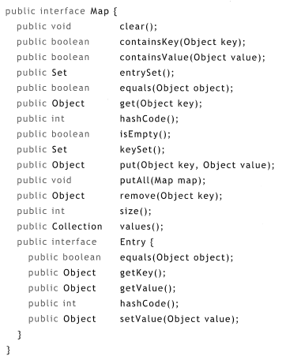

# 해시 테이블(Hash Table)

- 해시 테이블은 원소의 인덱스에 대한 사전 지식 없이 직접 접근을 제공하려고 시도하는 자료 구조이다. 
  - 이러한 시도는 원소의 내용으로부터 원소의 인덱스를 계산하는 해시 함수(Hash Function)을 이용해 가능해진다.

## 테이블과 레코드
- 레코드는 여러 개의 컴포넌트를 가진 복합적인 자료 구조이다. 
  - 자바에서는 레코드가 객체로서 구현된다.
  - 레코드는 외부 디스크 상에 데이터를 저장하기 위해 사용된다. 
  - 레코드의 정의에 사용되는 클래스는 통상적으로 메소드를 조금만 (존재한다면) 가지고 있다.
- 테이블이란 동일 타입의 레코드의 집합이다.
  - 테이블은 순서가 없는 자료 구조이다. 
  - 키 테이블(Keyed Table)이란 테이블에 저장된 레코드 전체에 대해서 값이 유일한 키 필드(key field)라는 특별한 필드 하나를 레코드 타입이 포함하는 테이블이다. 
    - 각 키는 레코드 식별에 사용된다.
    - 키 테이블은 컴퓨터 데이터베이스의 기본적인 빌딩 블록이다. 
    - 유일한 값을 가진 하나의 열을 보유한 테이블은 단순히 그 열을 키 필드로 지정함으로써 키 테이블로 간주될 수 있다. 
    - 키 테이블은 맵(Map) 또는 사전(Dictionary) 라고도 한다.
    - 맵이라는 용어는 매핑 또는 입력/출력 과정이라고 하는 수학적 아이디어로부터 유래되었다. 
    - 즉, 입력은 키이고, 출력은 그 키에 대한 레코드의 나머지 부분이 된다.
    - 수학에서 함수 또는 매핑은 y = f(x)일 때, 모든 순서쌍 (x,y)의 집합인 그래프에 의해 식별된다. 
    - 마찬가지로 키 테이블 또는 맵은 키/값 쌍의 집합이다. 

## 맵에 대한 ADT
- 맵은 유일한 키를 갖는 키 보유 레코드의 컬렉션이다.
  - 연산
    - Initialize : 공백 맵을 생성
    - Search : 주어진 키에 대해 테이블에서 그 키를 가진 레코드를 탐색. 발견시 그 값을 리턴. 그렇지 않으면 null 리턴
    - Insert/Update : 주어진 레코드에 대해 테이블에서 그 키를 가진 레코드를 탐색. 발견 시 그 테이블 레코드의 값을 주어진 레코드의 값으로 대체하고 대체된 값을 리턴. 그렇지 않으면 주어진 레코드를 테이블에 삽입
    - Delete : 주어진 키에 대해 테이블에서 그 키를 가진 레코드를 탐색. 발견시 해당 레코드를 테이블에서 삭제하고 그 값을 리턴. 그렇지 않으면 null 리턴
    - Count : 테이블의 레코드 수를 리턴
- 이 ADT는 최소한의 연산 집합만을 명세하고 있음에 유의해야 한다.
```java
public interface Map {

    public Object get(Object key);
    // RETURN: value
    // POST: if value != null, then (key, value) is in this map;
             if value == null, then no record in this map has the given key;

    public Object put(Object key, Object value);
    // RETURN: oldValue;
    // POST: if oldValue == null, then (key, value) is in this map;
    //       if oldValue != null, then (key, oldVlaue) was in this map;

    public Object remove(Object key);
    // RETURN: oldValue;
    // POST: if oldValue == null, no record in this map has the given key;
             if oldValue != null, then (key, oldValue) was in this map;

    public int size();
    // RETURN: n;
    // POST: this map contains n records;
}
```

## 해시 테이블
- 자료 구조에 대한 추가적인 구성 없이는 키 테이블에 대한 접근은 순차적이다.
- 테이블이 키 값에 의해 정렬되고 배열에 저장되어 있다면, 이진 탐색으로 구현하여 접근시간을 O(n)에서 O(log n)으로 개선할 수 있다. 
- 그러나 해싱(hashing)을 이용하면, 정렬하지 않고서도 더 좋은 성능을 낼 수 있다.
- 키 테이블에 대한 해시 함수는 테이블에서 주어진 키 값을 가지고 있는 레코드의 위치(배열 인덱스)를 리턴하는 함수이다. 
  - 해시 테이블은 해시 함수를 가진 키 테이블이다.
- 자바의 Object 클래스는 임의의 객체에 대해 int를 리턴하는 hashCode() 메소드를 정의하고 있다.
  - 그러므로 자바에서 모든 객체는 자기 자신의 해시 코드를 가진다. 
  - 이 코드는 객체 안에 저장된 데이터로부터 계산된다.
- 해시 함수는 거의 상수 시간에 해시 테이블의 원소를 접근할 수 있게 해준다. 
```java
public class HashTable implements Map {

    private Entry[] entries = new Entry[11];
    private int size, used;
    private float loadFactor;
    private final Entry NIL = new Entry(null, null); // 빈 항목
    
    public HashTable(int capacity, float loadFactor) {
        entries = new Entry[capacity];
        this.loadFactor = loadFactor;
    }
    
    public HashTable(int capacity) {
        this(capacity, 0.75F);
    }
    
    public HashTable() {
        this(101);
    }
    
    public Object get(Object key) {
        
        int h = hash(key);
        
        for (int i = 0; i < entries.length; i++) {
            
            int j = nextProbe(h, i);
            Entry entry = entries[j];
            if (entry == null) break;
            if (entry == NIL) continue;
            if (entry.key.equals(key)) return entry.value; // 성공
        }
        
        return null; // key not found 실패
    }
    
    public Object put(Object key, Object value) {
        
        if (used > loadFactor * entries.length) rehash();
        
        int h = hash(key);
        for (int i = 0; i < entries.length; i++) {
            
            int j = nextProbe(h, i);
            Entry entry = entries[j];
            
            if(entry == null) {
                entries[j] = new Entry(key, value);
                ++size;
                ++used;
                return null; // 삽입 성공
            }
            
            if (entry == NIL) continue;;
            if (entry.key.equals(key)) {
                
                Object oldValue = entry.value;
                entries[j].value = value;
                return oldValue; // update 성공
            }
        }
        
        return null; // table overflow 실패
    }
    
    public Object remove(Object key) {
        int h = hash(key);
        for (int i = 0; i < entries.length; i++) {
            
            int j = nextProbe(h, i);
            Entry entry = entries[j];
            
            if (entry == null) break;
            if (entry == NIL) continue;
            
            if (entry.key.equals(key)) {
                Object oldValue = entry.value;
                entries[j] = NIL;
                --size;
                return oldValue; // 성공
            }
        }
        return null; // 실패 : 키를 발견하지 못함.
    }
    
    public int size() {
        return size;
    }
    
    private class Entry {
        Object key, value;
        Entry(Object k, Object v) { key = k; value = v; }
    }
    
    private int hash(Object key) {
        return (key.hashCode() & 0x7FFFFFFF) % entries.length;
    }

    private int nextProbe(int h, int i) {
        return (h + i) % entries.length; // 선형 조사
    }

    private void rehash() {
        Entry[] oldEntries = entries;
        entries = new Entry[2 * oldEntries.length + 1];

        for(int k = 0; k < oldEntries.length; k++) {

            Entry entry = oldEntries[k];
            if (entry == null || entry == NIL) continue;
            int h = hash(entry.key);

            for(int i = 0; i < entries.length; i++) {

                int j = nextProbe(h, i);
                if (entries[j] == null) {
                    entries[j] = entry;
                    break;
                }
            }
        }
        used = size;
    }
}
```

## 선형 조사
- 해시 테이블에서 충돌(collision)을 해결하는 가장 단순한 방법은 충돌된 레코드를 배열의 가용한 다음 셀에 저장하는 것이다.
- 이러한 알고리즘은 각 "조사"에서 배열의 인덱스를 1씩 증가시키므로 선형 조사(linear probing)라고 한다. 
- 이러한 방법은 해당 원소가 해시 값에 의해 인덱스된 슬롯에 항상 배치되지는 않고 테이블의 임의의 장소에서 끝날 수 있기 때문에, 개방 주소법(open addressing)이라고도 한다.

## 재해싱
- 오버플로우 문제를 해결하는 방법은 더 큰 배열을 사용하여 테이블을 재구축하는 것에 있다.
- 이를 재해싱(rehashing) 이라고 한다. 
- 기존 배열 보다 크기가 2배인 배열을 생성해 기본 배열의 모든 항목들을 새 배열로 이동시킨다. 
- rehash() 메소드로 구현된다. 
- 구현 방식은 다음과 같다.
  - 먼저 새로운 참조 oldEntries[]를 기존 배열로 할당하여, 클래스 필드 이름 entries[]가 새 배열을 참조하기 위해 사용될 수 있도록 한다.
  - 새 배열의 길이는 기존 배열의 길이가 m일 때, 2m + 1로 설정한다. 
  - +1은 길이를 홀수로 만들기 위해 사용되며 제수의 수를 줄여준다.
  - 해시 테이블의 성능은 배열 길이가 더 적은 수의 제수를 가질 때 좋아지는 경향이 있다. 
- rehash() 메소드는 모든 NUL 참조를 제거한다.
  - 즉, NIL 참조를 새 배열로 복사하지 않는다. 
  - 그러므로 rehash()의 호출은 성능을 개선시켜준다. 
  - 물론, 작은 공간으로 시작해 여러 번 재해싱하는 것보다는 해시 테이블을 충분한 크기의 공간으로 초기화시켜 시작하는 것이 보다 효율적이다. 
- 어떠한 경우든, 테이블이 포화 상태에 이르기 전에 rehash()를 호출하는 것이 좋은 전략이라고 알려져 있다.
  - 이는 rehash()에 대한 호출을 발생시키는 임계 크기를 설정해 수행할 수 있다. 
  - 단, 위의 구현에서는 임계 값을 저장하는 대신 최대 비율 r = n/m을 명세한다. 
  - 여기서 n = size, m = entries.length 이다. 
  - 이 비율을 적재율(load factor)이라고 하며, 그 상한 값은 대게 75%나 80% 근처로 설정한다.

## 기타 충돌 해결 알고리즘
- 선형 조사는 충돌의 해결에 있어서 단순하고 어느 정도 효율적인 방법이다.
- 그러나 해시 함수가 테이블 전체에 대해 레코드를 균일하게 분배하는 데 실패하면 선형 조사는 함께 묶인 레코드의 긴 체인을 만들 수 있다.
  - 이를 기본 집중(primary clustering)이라고 한다. 
- 선형 조사에 대한 하나의 대안은 제곱 조사(quadratic probing)이다. 
  - 이 알고리즘은 매번 1씩 증가하는 대신 점진적으로 더 큰 폭으로 증가시켜 충돌을 해결한다. 
  - 구현 방식은 충돌 후 h에 i를 더하는 것이 아닌 i * i를 더하는 식이다. 
  - 제곱 조사는 선형 조사의 충돌 횟수를 반으로 줄이고 있다.
    - 이와 같은 개선은 제곱 조사가 사용이 안 된 갭을 중간에 남겨 두어 선형 조사보다 적은 집중을 가져오기 때문이다. 

## 별도 체인
- 앞에서의 해시 알고리즘은 개방 주소법이라고 불려지는데, 이는 충돌 해결을 위해 배열 내부에서 개방된 위치를 탐색하기 때문이다.
- 폐쇄 주소법(closed addressing)이라고 하는 대안적인 방법에서는 하나의 해시 위치에 1개 보다 많은 레코드를 허용함으로써 충돌을 회피한다. 
  - 이 결과 보다 복잡한 자료 구조가 필요하게 된다. 
  - 레코드의 배열 대신에 버켓의 배열을 사용하게 되며, 여기서 버켓(bucket)이란 일종의 레코드의 컬렉션이다. 
  - 가장 단순한 자료 구조는 하나의 버켓에 대해 하나의 연결 리스트를 사용하는 것이다. 
  - 이를 별도 체인(separate chaining)이라고 한다. 
  - 폐쇄 주소법의 경우 체인 길이에 제한이 없으므로, 적재율이 지원 배열의 길이를 초과할 수 있다.
  - 그러나 긴 체인을 허용하게 되면 해시 테이블이 성능이 저하되므로 테이블 size가 주어진 임계값을 넘어가면 재해싱을 수행하도록 한다. 
  - 단, 일부 체인이 매우 길어질 수 있으며, 이로 인한 매우 불균형한 버켓 체인의 배열은 해싱이 제공해야 할 상수 시간 접근의 장점을 파괴할 수도 있다.

```java
public class HashTable implements Map {

    private Entry[] entries;
    private int size;
    private float loadFactor;

    public HashTable(int capacity, float loadFactor) {
        entries = new Entry[capacity];
        this.loadFactor = loadFactor;
    }

    public HashTable(int capacity) {
        this(capacity, 0.75F);
    }

    public HashTable() {
        this(101);
    }

    public Object get(Object key) {

        int h = hash(key);

        for (Entry e = entries[h]; e != null; e = e.next) {
            if (e.key.equals(key)) return e.value; // 성공
        }

        return null; // key not found 실패
    }

    public Object put(Object key, Object value) {

        int h = hash(key);

        for (Entry e = entries[h]; e != null; e = e.next) {

            if (e.key.equals(key)) {
                Object oldValue = e.value;
                e.value = value;
                return oldValue; // 수정 성공
            }
        }

        entries[h] = new Entry(key, value, entries[h]);
        ++size;
        if (size > loadFactor * entries.length) rehash();

        return null; // 증분 성공
    }

    public Object remove(Object key) {
        int h = hash(key);

        for (Entry e = entries[h], prev = null; e != null; prev = e, e = e.next) {

            if (e.key.equals(key)) {

                Object oldValue = ve.value;

                if (prev == null) entries[h] = e.next;
                else prev.next = e.next;
                --size;
                return oldValue; // 성공
            }
        }
        return null; // 실패 : 키를 발견하지 못함.
    }

    public int size() {
        return size;
    }

    private class Entry {
        Object key, value;
        Entry next;

        Entry(Object k, Object v, Entry n) {
            key = k;
            value = v;
            next = n
        }

        public String toString() {
            return key + " = " + (Country) value;
        }
    }

    private int hash(Object key) {

        if (key == null) throw new IllegalArgumentException();
        return (key.hashCode() & 0x7FFFFFFF) % entries.length;
    }

    private void rehash() {
        Entry[] oldEntries = entries;
        entries = new Entry[2 * oldEntries.length + 1];

        for (int k = 0; k < oldEntries.length; k++) {

            for (Entry old = oldEntries[k]; old != null; ) {

                Entry e = old;
                old = old.next;
                int h = hash(e.key);
                e.next = entries[h];
                entries[h] = e;
            }
        }
    }
}
```

## java.util.HashMap 클래스
- 표준 java 클래스 라이브러리는 java.util 패키지 안에 정의된 HashMap 이라는 이름의 해시 테이블 클래스를 포함하고 있다. 
- 디폴트 초기 용량은 101이며, 디폴트 최대 적재율이 0.75인 폐쇄 주소법을 사용하고 있다. 
- 
