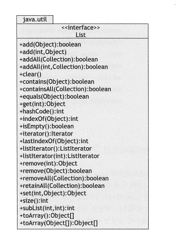

# 리스트(List)


- List는 2개의 구체 리스트 클래스인 ArrayList와 LinkedList를 제공하고 있다. 
- ArrayList는 원소 저장에 배열을 사용하므로 상수 접근 시간을 제공하며 삽입과 삭제에는 선형 시간을 필요로 한다.
- LinkedList 클래스는 원소 저장에 연결 리스트를 사용하며 삽입과 삭제를 상수 시간에 수행하지만, 원소 위치 탐색에는 선형 시간을 필요로 한다.
- 리스트는 선형 구조이므로 리스트에 대한 후향 이동도 전향 이동 보다 더 복잡해서는 안 된다. 
- 리스트의 인터페이스 구조는 다음과 같다.
- 
- 위 인터페이스 중 리스트를 위해 세분화된, 인덱스와 관련되어 있거나 ListIterator 객체를 리턴하는 10개의 새로운 메소드를 제외한 메소드는 java.util.Collection 인터페이스로부터 계승된 것이다.
- 자바에서 리스트는 인덱스된 컬렉션이다. 
  - 따라서 자바의 모든 리스트는 배열처럼 인덱스를 가진다.

## Linked List

- 여러 개의 노드들이 순차적으로 연결된 형태를 가진다. 
- 자료들을 반드시 연속적으로 배열시키지는 않고, 임의의 기억 공간에 기억시키되 자료 항목의 순서에 따라 노드의 포인터 부분을 이용하여 서로 연결 시킨 자료구조다.
- 첫 번째 노드를 Head, 마지막 노드를 Tail이라고 한다.
- 각 요소가 데이터와 다음 요소를 가리키는 포인터로 구성되는 선형 자료구조이다.
- 각 요소는 메모리에서 임의의 위치에 할당되며, 요소들은 포인터를 통해 연결된다. 
- 배열과는 달리 메모리를 연속적으로 사용하지 않는다.
  - 이는 순차적으로 접근해야 하는 면에서는 불리하나, 노드가 연결된 구조이기에 삽입과 삭제에 용이하다.
  - 또한, 요소에 접근하기 위해선 전체 리스트를 순회해야 하므로 탐색 속도가 느리다. 
- 기억 공간이 연속적으로 놓여있지 않아도 저장이 가능하다. 
- 선형 리스트와 달리 가변적인 크기의 리스트를 가진다. 
- 중간 노드의 연결이 끊어질 경우 다음 노드를 찾기 어렵다. 

## ArrayList

- 연속적인 데이터의 리스트이다. 
  - 데이터는 연속적으로 리스트에 들어있어야 하며, 중간에 빈 공간이 있으면 안 된다. 
  - ArrayList 클래스는 내부적으로 Object[] 배열을 이용하여 요소를 저장한다.
  - 배열을 이용하기에 인덱스를 이용해 요소에 빠르게 접근할 수 있다. 
  - 가변적으로 공간을 늘리거나 줄일 수 있다. 
    - 단, 배열 공간이 가득 찰 때마다 배열을 copy 하는 방식으로 늘리므로 지연이 발생한다
  - 데이터를 리스트 중간에 삽입/삭제할 경우 요소들의 위치를 재배열하므로 삽입/삭제 동작이 느리다.
## ContiguousList 구현체
```java
package list;

import java.util.*;

public class ContiguousList extends AbstractList{
	private static final int INITIAL_LENGTH=100;
	private Object[] objects;
	private int size;

	public ContiguousList() {
		this(INITIAL_LENGTH);
	}
	
	public ContiguousList(int capacity) {
		objects = new Object[capacity];
	}
	
	public ContiguousList(Collection collection) {
		int n = collection.size();
		objects = new Object[2*n];
		Object[] a = collection.toArray();
		System.arraycopy(a, 0, objects, 0, n);
	}
	
	public void add(int i, Object object) {						// optional override
		if(i < 0 || i > size) throw new ArrayIndexOutOfBoundsException();
		if(size == objects.length) resize();
		System.arraycopy(objects, i, objects, i+1, size -i);	// shift up
		objects[i] = object;
		++size;
	}
	
	@Override
	public Object get(int i) {								// override required by AbstractList
		if(i < 0 || i > size) throw new ArrayIndexOutOfBoundsException();
		return objects[i];
	}

	public Object remove(int i) {							// optional override
		if(i < 0 || i > size) throw new ArrayIndexOutOfBoundsException();
		Object object = objects[i];
		System.arraycopy(objects, i+1, objects, i, size-i-1);	//shift down
		objects[--size] = null;
		return object;
	}
	
	public Object set(int i, Object object) {					// optional override
		if(i < 0 || i > size) throw new ArrayIndexOutOfBoundsException();
		Object oldObject = objects[i];
		objects[i] = object;
		return oldObject;
	}
	
	@Override
	public int size() {											// override required by AbstractList
		return size;
	}
	
	private void resize() {
		Object[]temp = new Object[2*objects.length];
		System.arraycopy(objects, 0, temp, 0, size);
		objects = temp;
	}

}
```

## AbstractSequentialList 구현체
```java
package list;

import java.util.*;
public class Sequence extends AbstractSequentialList{
	private Node head = new Node(null, null, null);
	private int size;
	
	public Sequence() {
		head.prev = head.next = head;
	}
	
	public Sequence(Collection collection) {
		this();
		addAll(collection);
	}
	
	@Override
	public ListIterator listIterator(int index) {		// required override
		return new SequenceIterator(index);
	}

	@Override
	public int size() {									// required override
		return size;
	}
	
	private static class Node{
		Node prev, next;
		Object object;
		Node(Node p, Node n, Object o){
			this.prev = p; this.next = n; this.object = o;
		}
	}

	private class SequenceIterator implements ListIterator{
		private Node last, next;
		private int nextIndex;
		
		public SequenceIterator(int i) {
			if(i < 0 || i > size) throw new IndexOutOfBoundsException();
			nextIndex = i;
			next = head.next;
			for(int j = 0; j < i; j++) 
				next = next.next;
		}
		
		public void add(Object object) {
			Node newNode = new Node(next.prev, next, object);
			newNode.prev.next = next.prev = newNode;
			++size;
			++nextIndex;
			last = null;
		}
		
		public boolean hasNext() {
			return nextIndex < size;
		}
		
		public boolean hasPrevious() {
			return nextIndex > 0;
		}
			
		public Object next() {
			if(!hasNext()) throw new NoSuchElementException();
			last = next;
			next = next.next;
			++nextIndex;
			return last.object;
		}
		
		public int nextIndex() {
			return nextIndex;
		}
		
		public Object previous() {
			if(!hasPrevious()) throw new NoSuchElementException();
			next = last = next.prev;
			--nextIndex;
			return last.object;
		}
		
		public int previousIndex() {
			return nextIndex-1;
		}
		
		public void remove() {
			if(last == null) throw new IllegalStateException();
			last.prev.next = last.next;
			last.next.prev = last.prev;
			last = null;
			--size;
			--nextIndex;
		}
		
		public void set(Object object) {
			if(last == null) throw new IllegalStateException();
			last.object = object;
		}
		
	}
}
```