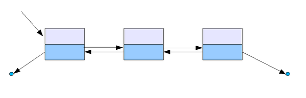
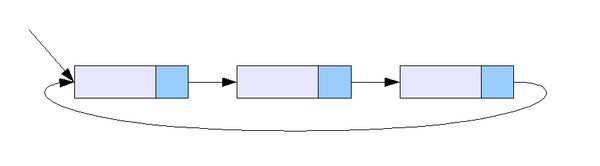

# Linked List

### 연결 리스트(Linked List)

연결리스트는 각 노드가 데이터와 포인터를 가지고 한 줄로 연결되어 있는 방식의 자료구조이다.

데이터를 담고 있는 노드들이 연결되어 있고, 노드의 포인터가 이전 노드와 다음 노드와의 연결을 담당한다.

```java
class Node {
	Node next;       // 다음 요소의 주소를 저장
	Object obj;      // 데이터를 저장
}
```


배열의 경우 데이터가 연속적으로 존재하지만 연결 리스트는 불연속적으로 존재하는 데이터를 서로 연결(link)한 상태로 구성되어있다.

→ 그림과 같이 자신과 연결된 다음 요소에 대한 참조(주소값)과 데이터로 구성되어있다.

```java
LinkedList<Integer> list= new LinkedList<Integer>();
LinkedList<Integer> list2 = new LinkedList<Integer>(Arrays.asList(1,2));//생성시 값추가

list.addFirst(1);//가장 앞에 데이터 추가
list.addLast(2);//가장 뒤에 데이터 추가
list.add(3);//데이터 추가 (index가 없는 경우 가 뒤에 데이터 추가)
list.add(1, 10);//index 1에 데이터 10 추가

list.removeFirst(); //가장 앞의 데이터 제거
list.removeLast(); //가장 뒤의 데이터 제거
list.remove(); //생략시 0번째 index제거
list.remove(1); //index 1 제거
list.clear(); //모든 값 제거

```


→ 입력받은 값으로 노드를 생성하여 추가하고자 하는 위치의 이전 노드의 참조를 새 노드에 대한 참조로 변경해주고, 새 노드가 그 다음 노드를 참조하도록 변경한다.

→ 삭제의 경우 이전 노드가 삭제하고자 하는 노드의 다음 노드를 참조하도록 변경만 하면 된다. 배열처럼 데이터를 이동하기 위해 복사하는 과정이 없기 때문에 처리 속도가 매우 빠르다.
---

### 연결리스트 구현

```java
public class LinkedList {
    // 첫번째 노드를 가리키는 필드
    private Node head;
    private Node tail;
    private int size = 0;
    private class Node{
        // 데이터가 저장될 필드
        private Object data;
        // 다음 노드를 가리키는 필드
        private Node next;
        public Node(Object input) {
            this.data = input;
            this.next = null;
        }
        // 노드의 내용을 쉽게 출력해서 확인해볼 수 있는 기능
        public String toString(){
            return String.valueOf(this.data);
        }
    }
}

// 리스트 앞에 데이터 삽입
public void addFirst(Object input){
    // 노드를 생성합니다.
    Node newNode = new Node(input);
    // 새로운 노드의 다음 노드로 해드를 지정합니다.
    newNode.next = head;
    // 헤드로 새로운 노드를 지정합니다.
    head = newNode;
    size++;
    if(head.next == null){
        tail = head;
    }
}

// 리스트 마지막에 데이터 삽입
public void addLast(Object input){
    // 노드를 생성합니다.
    Node newNode = new Node(input);
    // 리스트의 노드가 없다면 첫번째 노드를 추가하는 메소드를 사용합니다.
    if(size == 0){
        addFirst(input);
    } else {
        // 마지막 노드의 다음 노드로 생성한 노드를 지정합니다.
        tail.next = newNode;
        // 마지막 노드를 갱신합니다.
        tail = newNode;
        // 엘리먼트의 개수를 1 증가 시킵니다.
        size++;
    }
}

// index를 지정하여 중간에 데이터 삽입
public void add(int k, Object input){
    // 만약 k가 0이라면 첫번째 노드에 추가하는 것이기 때문에 addFirst를 사용합니다.
    if(k == 0){
        addFirst(input);
    } else {
        Node temp1 = node(k-1);
        // k 번째 노드를 temp2로 지정합니다.
        Node temp2 = temp1.next;
        // 새로운 노드를 생성합니다.
        Node newNode = new Node(input);
        // temp1의 다음 노드로 새로운 노드를 지정합니다.
        temp1.next = newNode;
        // 새로운 노드의 다음 노드로 temp2를 지정합니다.
        newNode.next = temp2;
        size++;
        // 새로운 노드의 다음 노드가 없다면 새로운 노드가 마지막 노드이기 때문에 tail로 지정합니다.
        if(newNode.next == null){
            tail = newNode;
        }
    }
}

// 데이터 삭제
public Object removeFirst(){
    // 첫번째 노드를 temp로 지정하고 head의 값을 두번째 노드로 변경합니다.
    Node temp = head;
    head = temp.next;
    // 데이터를 삭제하기 전에 리턴할 값을 임시 변수에 담습니다. 
    Object returnData = temp.data;
    temp = null;
    size--;
    return returnData;
}

// index를 지정하여 데이터 삭제
public Object remove(int k){
    if(k == 0)
        return removeFirst();
    // k-1번째 노드를 temp의 값으로 지정합니다.
    Node temp = node(k-1);
    // 삭제 노드를 todoDeleted에 기록해 둡니다. 
    // 삭제 노드를 지금 제거하면 삭제 앞 노드와 삭제 뒤 노드를 연결할 수 없습니다.  
    Node todoDeleted = temp.next;
    // 삭제 앞 노드의 다음 노드로 삭제 뒤 노드를 지정합니다.
    temp.next = temp.next.next;
    // 삭제된 데이터를 리턴하기 위해서 returnData에 데이터를 저장합니다.
    Object returnData = todoDeleted.data; 
    if(todoDeleted == tail){
        tail = temp;
    }
    // cur.next를 삭제 합니다.
    todoDeleted = null; 
    size--;
    return returnData;
}
```
---

### 이중 연결 리스트 (Doubly Linked List)

연결 리스트는 이동방향이 단방향이기 때문에 다음 노드에 대한 접근은 쉽지만 이전 요소에 대한 접근은 어렵다. 이를 보완하기 위해 사용하는 것이 이중 연결 리스트이다.



이중 연결리스트는 연결리스트에 참조변수를 하나 더 추가하여 다음 노드에 대한 참조뿐 아니라 이전 요소에 대한 참조가 가능하게 했으며 그 외에는 연결리스트와 동일하다.

```java
class Node {
	Node next;       // 다음 요소의 주소를 저장
	Node previous;   // 이전 요소의 주소를 저장
	Object obj;      // 데이터를 저장
}
```

---

### 원형 연결 리스트(Doubly Circular Linked List)

이중 연결리스트의 첫 번째 노드와 마지막 노드를 서로 연결시킨 형태

→ 마지막에 노드를 삽입하는 것이 첫번째에 노드를 삽입하는 것과 같은 의미를 가진다.



---

> LinkedList 클래스는 ‘더블 링크드 리스트’로 구현되어 있는데, 이는 링크드 리스트의 단점인 낮은 접근성을 높이기 위해서이다.
> 

### ArrayList와 LinkedList

> 둘 다 List 인터페이스를 구현했기 때문에 메서드의 종류와 기능은 거의 동일
> 
- 순차적으로 추가/삭제하는 경우에는 ArrayList가 더 빠르다.
    
    → 순차적으로 삭제한다는 것은 마지막 데이터 부터 역순으로 삭제해나간다는 것을 의미한다. ArrayList의 경우 마지막 데이터부터 삭제할 경우 마지막 요소의 값을 null로 바꾸면 되므로 더 빠르다.
    
- 중간 데이터를 추가/삭제하는 경우에는 LinkedList가 더 빠르다.
    
    → 중간 요소를 추가 또는 삭제하는 경우, LinkedList는 각 노드간의 연결만 변경해주면 되기 떄문에 처리 속도가 빠르다. 하지만 ArrayList의 경우 각 요소들을 재배치하여 추가할 공간을 확보하거나 빈 공간을 채워야하기 때문에 처리속도가 늦다.
    

|  | 읽기(접근시간) | 추가/삭제 | 특징 |
| --- | --- | --- | --- |
| ArrayList | 빠르다 | 느리다 | - 순차적인 추가 삭제는 더 빠름
- 비효율적인 메모리 사용 |
| LinkedList | 느리다 | 빠르다 | - 데이터가 많을수록 접근성이 떨어진다. |

 

---

참고자료

- 점프 투 자바 / 박응용
- 자바의 정석 / 남궁성