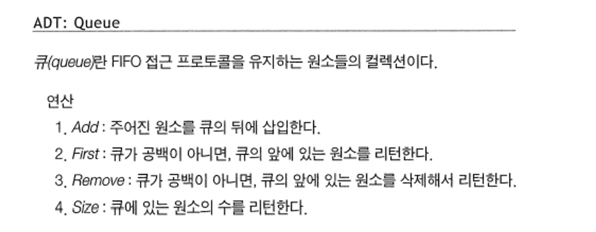
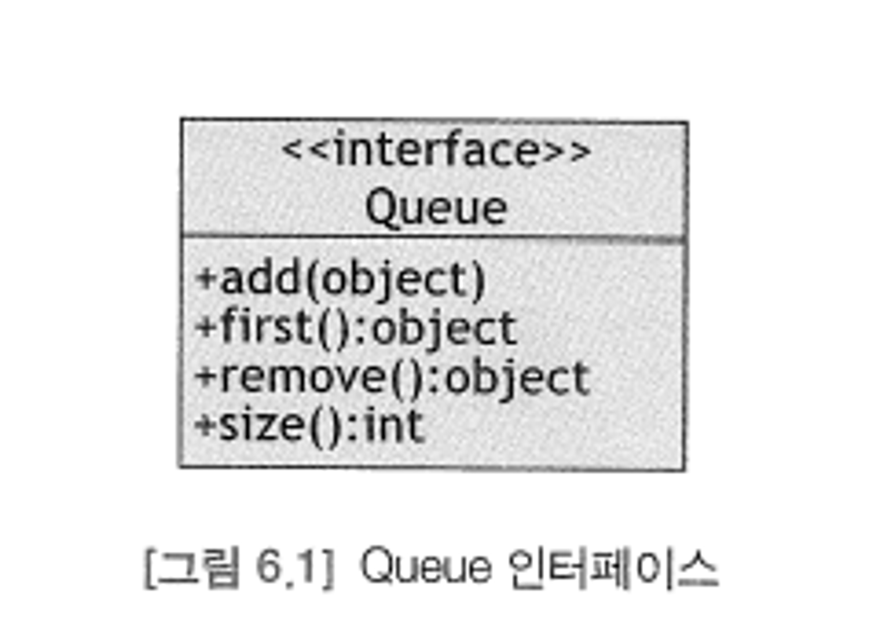

# 큐(Queue)


### 정의

- 큐 자료 구조는 스택 자료 구조와 거의 동일하다. 그러나 원소를 동일한 한쪽 끝에서 삽입하고 삭제하는 스택과 달리, 큐는 한쪽 끝에 삽입하고 다른 한쪽 끝에서 삭제한다.
- 큐(Queue)는 선입선출(FIFO: First-In-First-Out) 프로토콜을 구현하는 자료구조다. 이 구조에서의 접근점은 원소가 삽입되고 제거되는 양쪽 끝이 된다. 
  - 삽입은 항상 큐의 뒤(back 또는 near)에서 수행되고 제거는 항상 앞(front)에서 진행된다.
- ADT로서의 큐에 대한 정형적인 기술은 다음과 같다.
  
  
- 큐와 스택의 연산의 이름 외의 실제적인 차이는 큐는 새로운 원소를 이들이 접근되는 반대편 끝에 추가하고 스택은 동일한 끝에 추가한다는 점이다.
- add, first, remove, size는 Java의 Collection Framework의 대부분의 자료 구조에서 사용된다.
- Queue 인터페이스를 구현하는 방법 중 가장 단순한 한 가지 방법은 배열을 이용하는 방법이다. 
  - 이 때 배열 구현에 대한 가장 단순한 대안은 연결 구현이며, 연결 구현은 배열 구현에 비해 2개의 중요한 장점을 가진다. 
    1. 연결 구현은 더 빠르다.더 빠른 이유는 삽입과 삭제를 위한 위치가 항상 동일하게 뒤와 앞이기 떄문이며, 
    2. 연결 구현은 공간을 낭비하지 않는다. 공간을 낭비하지 않는 이유는 제거된 노드가 Garbage Collector Process에 의해 삭제되기 떄문이다.
- 연결 구현 방식을 이용해 구현한 LinkedQueue Class의 경우, 구조상으로 빈 헤드 노드를 가진 원형 이중 연결 리스트이다. 
  - 원형 리스트는 null 링크 필드를 없애주며, 이중 링크는 리스트를 통한 양방향 순항을 가능하게 한다. 
  - 빈 헤드 노드는 삽입과 삭제 알고리즘을 단순하게 만들어준다.
- LinkedQueue 클래스의 중첩 Node 클래스는 object, prev, next 3개 필드를 가진다. 
  - object와 next 필드는 LInkedStack 클래스에서와 동일한 역할 (꺼내질 객체와 다음 객체를 가리키는 포인터 객체)을 한다. 
  - prev 필드는 각 노드에 대한 두 번째의, 역 방향 링크를 제공한다. 
  - 디폴트로는 양 링크 필드가 this로 초기화되어 새 노드의 각 링크가 자기 자신을 가리키게 된다. 
  - 이는 링크 필드가 null을 가질 수 없다는 요구사항을 준수시킨다.
- LinkedQueue 클래스 자신은 head와 size 두 개 필드를 가지며, head 링크는 항상 빈 헤드 노드를 가리킨다. 
  - 이 노드는 큐 자체가 생성될 때 1-인자 Node 생성자에 의해 생성된다.
- add() 메소드는 주어진 객체를 포함하는 새로운 노드를 리스트의 (오른쪽) 끝에 첨가한다. 
  - Node 생성자를 통해 prev 필드는 head.prev로, next 필드는 head로 설정한다.
- remove() 메소드는 리스트에서 첫 번째 데이터 노드를 제거한다. 
  - 이 노드는 head.next가 가리키는 노드이며, 이 노드의 object 필드가 메소드에 의해 리턴되어야 한다.

  
### 특징

- 일반적으로 연결리스트를 통해 구현하며, 선입선출을 필요로 하는 대기열, 프로세스 관리, 너비 우선 탐색에 사용된다.
- 대기 행렬 처리에 적합하다. (ex. 은행에서 먼저 온 사람의 업무를 창구에서 처리)
- 컴퓨터 버퍼에서 주로 사용한다. 마구잡이로 입력이 되었으나 처리를 하지 못할 때 버퍼를 만들어 대기시킨다.
- 큐의 Rear(끝)에서 이루어지는 삽입연산을 **인큐(EnQueue)**, Front(앞)에서 이루어지는 삭제연산을 **디큐(DeQueue)**라고 한다.

### Queue Method

- **add(item):** item을 리스트의 끝부분에 추가한다.
- **remove()**: 리스트의 첫 번째 항목을 제거한다.
- **peek()**: 큐에서 가장 위에 있는 항목을 반환한다.
- **isEmpty()**: 큐가 비어 있을 때에 true를 반환한다.

### 구현
> 연결 구조를 이용한 큐 임의 구현체
```java
public class LinkedQueue implements Queue{
	private Node head = new Node(null);
	private int size;
	
	@Override
	public void add(Object object) {
		head.prev = head.prev.next = new Node(object, head.prev, head);
		++size;
	}
	
	@Override
	public Object first() {
		if(size == 0) throw new IllegalStateException("the queue is empty");
		return head.next.object;
	}
	
	public boolean isEmpty() {
		return size == 0;
	}
	
	@Override
	public Object remove() {
		if(size == 0) throw new IllegalStateException("the queue is empty");
		Object object = head.next.object;
		head.next = head.next.next;
		head.next.prev = head;
		--size;
		return object;
	}
	
	@Override
	public int size() {
		return size;
	}
	
	private static class Node{
		Object object;
		Node prev = this, next = this;
		
		Node(Object object){
			this.object = object;
		}
		
		Node(Object object, Node prev, Node next){
			this.object = object;
			this.prev = prev;
			this.next = next;
		}
	}
	
}
```