# 탐색 트리(Search Tree)

- 탐색 트리는 이진 탐색 알고리즘에 사용된 아이디어를 일반화하여 거의 상수 시간에 가까운 로그 접근 시간을 제공한다. 
- 각각의 탐색 트리는 다음과 같은 조건을 만족하는 것으로 가정한다.
  - 탐색 트리 구조 내에 있는 키는 유일하다.
  - 각각의 키는 그것이 표현하는 데이터의 주소를 가지고 있다.
  - 키의 타입은 java.lang.Comparable 인터페이스를 구현한다.

## 이진 검색 트리
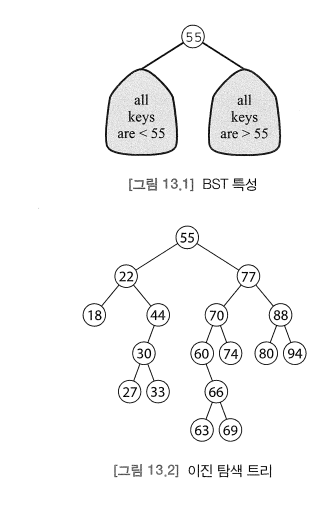
- 이진 검색 트리(BST; binary search tree)는 각각의 노드가 다음과 같은 BST 특성을 만족하는 키-주소 쌍을 가지고 있는 이진 트리다.
  - 트리에 있는 각각의 키에 대해, 왼쪽 서브트리에 있는 모든 키는 이것보다 작고,
  - 오른쪽 서브트리에 있는 모든 키는 이것보다 크다. 
- BST 특성은 루트에만 적용되는 것이 아니라 모든 노드에 적용된다. 

### 이진 탐색 트리 순회
> BST 검색   
> 입력 : 이진 탐색 트리 T와 키.   
> 출력 : 키를 위한 데이터 주소 또는 키가 T에 없다면 null.   
> 1. 만일 T가 공백이면, null을 리턴
> 2. 만일 key < root.key 이면, 키를 찾기 위해 왼쪽 순환 탐색에 의해 반환되는 값을 리턴.
> 3. 만일 key > root.key 이면, 키를 찾기 위한 오른쪽 순환 탐색에 의해 반환되는 값을 리턴. 
> 4. root.address를 리턴.
- 이진 탐색 트리의 중위 순회는 키를 오름차순으로 방문한다. 
- 따라서 BST 검색은 이진 탐색 알고리즘과 마찬가지로 분할-정복 전략을 사용하며, 트리가 균형적일 때 BST 알고리즘이 O(log(n)) 시간에 실행된다는 것을 의미한다.
- 키를 탐색하는데 사용되는 비교 횟수는 결코 트리의 높이보다 크지 않다.
- 트리가 불균형 상태에 있을 때라도 탐색 경로의 평균 길이는 2log(n)이 된다. 
> BST 삽입   
> 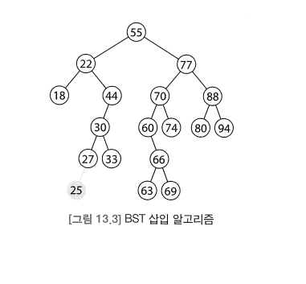
> 입력 : 이진 탐색 트리 T와 키-주소 쌍.   
> 출력 : 키가 T에 이미 있다면 false, 아니면 true.   
> 선조건: 키-주소 쌍은 T에 있음.   
> 1. 만일 T가 공백이면 키-주소 쌍을 포함하는 단독 트리를 만들고, true를 리턴. 
> 2. 만일 key < root.key 이면, 순환적으로 왼쪽 서브트리에서 키-주소 쌍의 삽입에 의해 반환되는 값을 리턴
> 3. 만일 key > root.key 이면, 순환적으로 오른쪽 서브트리에서 키-주소 쌍의 삽입에 의해 반환되는 값을 리턴.
> 4. false를 리턴. 
- BST 알고리즘의 로그 시간은 트리가 완벽하게 균형을 이루고 있는 최선의 경우와 함께 평균적인 경우에도 유지된다.
- 그러나 트리가 심각하게 불균형 상태에 있게 되면 성능은 매우 나빠지게 된다. 
- 최악의 경우 트리가 선형 리스트가 되고, 이러한 경우 수행 시간은 선형이 된다. 
- 삽입 알고리즘은 순환 호출을 만들기 위해 검색 알고리즘과 동일한 조건을 사용한다.
- 결과적으로 트리가 균형을 이루고 있을 때, 삽입 알고리즘은 탐색 알고리즘과 동일한 복잡도인 O(log(n))을 가진다. 

## BST 삭제
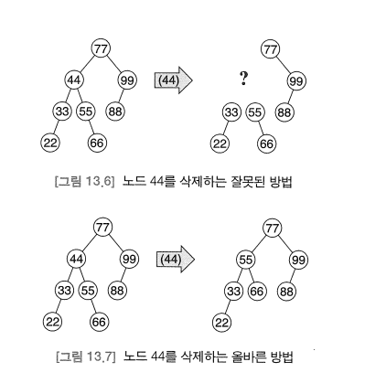
- 이진 탐색 트리로부터 원소를 삭제하는 것은 그것이 내부 노드일 수 있기 때문에 삽입보다 더 어렵다. 
- 이 경우의 해결 방법은 중위 후속자 노드로 삭제되는 노드를 교체하는 것이다. 
- 따라서 일반적인 삭제 알고리즘 이전에 BST 노드 x의 중위 후속자 y를 찾는 방법이 필요하다. 
- 이에는 다음과 같은 세 가지 가능성이 있다.
  1. 만일 x가 오른쪽 서브트리를 가지고 있다면, y는 이 서브트리에서 가장 왼쪽에 있는 노드이다.
  2. 그렇지 않고, 만일 x가 오른쪽 조상을 가지고 있다면, y는 가장 가까운 오른쪽 조상이다.
  3. 그렇지 않다면, x는 트리에서 가장 오른쪽에 있는 원소이므로 중위 후속자를 가지지 않는다. 

> BST 최소값   
> 입력 : 공백이 아닌 이진 탐색 트리 T.   
> 출력 : T에 있는 최소 노드.
> 1. x를 T의 루트라고 한다.
> 2. x.left가 공백이 아닌 동안 x = x.left로 설정
> 3. x를 리턴

> BST 후속자   
> 입력 : 공백이 아닌 이진 탐색 트리 T와 노드 x.
> 출력 : x의 중위 후속자 또는 x가 T의 최대 원소일 경우에는 null.   
> 선조건 : x는 T의 최대 노드가 아님 
> 1. 만일 x의 오른쪽 서브트리가 공백이 아니면, 그것의 최소값을 리턴 (BST 최소값 알고리즘 이용)
> 2. x가 오른쪽 자식인 동안 x = x.parent 로 설정
> 3. x.parent (null 이 될 수 있음)을 리턴
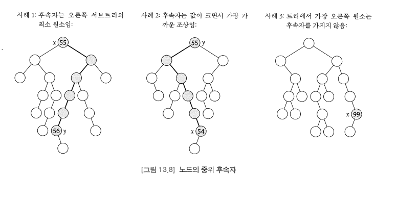

> BST 삭제   
> 입력 : 이진 탐색 트리 T와 키.   
> 출력 : T에서 키를 발견할 수 없으면 false; 아니면 true   
> 선조건 : 키는 T에 없음
> 1. 만일 T가 공백이면, false 리턴
> 2. 만일 key < root.key 이면, 순환적으로 왼쪽 서브트리로부터 키의 삭제에 의해 반환되는 값을 리턴.
> 3. 만일 key > root.key 이면, 순환적으로 오른쪽 서브트리로부터 키의 삭제에 의해 반환되는 값을 리턴. 
> 4. 만일 T가 단톡 트리면, 이것을 공백 트리로 만들고 true를 리턴
> 5. 만일 왼쪽 서브트리가 공백이면, T의 오른쪽 서브트리의 루트, 왼쪽, 오른쪽 필드를 T 자체에 복사하고, true 리턴
> 6. 만일 오른쪽 서브트리가 공백이면, T의 왼쪽 서브트리의 루트, 왼쪽, 오른쪽 필드를 T 자체에 복사하고, true 리턴
> 7. 오른쪽 서브트리에 대해 deleteMinimum 을 적용하여 반환되는 노드를 루트와 교체한다.

- 위의 BST 삭제 알고리즘은 삭제될 노드의 자식 수가 0, 1, 2개이냐에 따라 세 가지 분리된 경우를 가지고 있다.
  - 자식이 없다면 다른 영향 없이 직접 삭제할 수 있다
  - 하나의 자식을 가지고 있다면 자식을 삭제할 노드의 자리로 가지고 온다.
  - 두 개의 자식을 가지고 있다면 삭제될 노드를 그것의 중위 후속자로 교체하고 교체된 후속자를 삭제하면 된다.
    - 여기서 노드 x를 노드 y로 교체한다는 것은 노드 x에 있는 데이터와 연관된 데이터 주소를 모두 노드 y의 대응되는 필드로 교체한다는 것을 의미한다. 
    
> BST 최소값 삭제   
> 입력 : 공백이 아닌 이진 탐색 트리 T.   
> 출력: T에 있는 최소 노드 y.   
> 후조건: y는 T에서 제거됨.   
> 1. 만일 왼쪽 서브트리가 공백이면, 이것을 오른쪽과 교체한 다음 현재 노드를 리턴
> 2. 만일 왼쪽 서브트리가 리프이면, 이것을 왼쪽과 교체한 다음 현재 노드를 리턴
> 3. 최소값 삭제를 왼쪽에 적용하여 반환되는 노드를 리턴
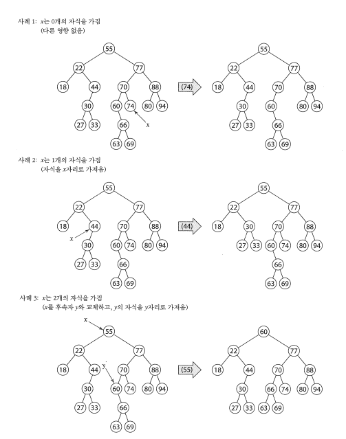

## BST 성능
- BST 탐색, 삽입, 삭제는 모두 트리의 하나 또는 두 개의 루트-리프 경로에 대해 배타적으로 동작한다
- 따라서 이것들 중의 어느 하나가 만드는 비교 횟수는 트리의 높이에 비례하게 된다. 
- 완전히 균형이 이루어진 이진 트리의 높이는 O(Log(n)) 이고, 완전히 불균형 상태인 이진 트리의 높이는 O(Log(n)) 이다.

> 이진 탐색 트리의 삽입과 탐색   
> BST 를 위한 삽입과 탐색 알고리즘은 다음의 시간 복잡도 함수를 가진다.   
> B(n) = O(1)   
> A(n) = O(log(n))   
> W(n) = O(n)

> 탐색과 삽입 알고리즘에 대한 평균 시간 복잡도   
> A(n) = (2n - 2 / n) * (H<sub>n+1</sub> - 1) - 1   
> H<sub>n</sub>은 n번째 조화수(harmonic number)로, H<sub>n</sub> = 1 + 1/2 + 2/3 + 0 ㆍㆍㆍ + 1/n 이 된다.

> BST 탐색과 삽입에 대한 평균 시간 복잡도   
> A(n) = O(1.39log(n)) = O(log(n))

- BST의 평균 실행 시간은 임의의 삽입과 삭제에서도 O(n)으로 낮아지는 경향이 있다. 
- 이는 삭제 알고리즘이 편향되어 있기 때문이다. 
- 중위 후속자를 사용하게 되면, 트리의 루트는 오른쪽으로 이동하는 경향을 보이고, 이것은 트리를 왼쪽으로 커지게 만든다. 
  - 이러한 불균형을 방지하기 위해서는 알고리즘을 호출할 때마다 후속자 대신 중위 선행자를 사용하도록 약간 수정한 알고리즘을 임의로 선택하도록 삭제 알고리즘을 수정할 수 있다.
  - 단, 위와 같은 개선에도 불구하고 BST 는 삽입과 삭제가 임의로 진행되지 않을 경우 최악의 선형 구조로 되어질 우려가 있다. 

## AVL 트리
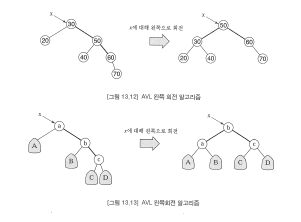
- AVL 트리는 어떤 노드에서도 두 서브트리가 거의 같은 노드를 갖도록 강제하여 균형을 유지하는 이진 탐색 트리이다. 
- 이는 불균형이 발생할 때마다 서브트리를 회전하여 균형을 맞춘다. 
  - 삽입이 어떤 노드의 서브트리 중의 하나가 다른 서브트리보다 한 레벨 이상 깊어지도록 할 경우 그 노드에 대한 회전을 수행한다.
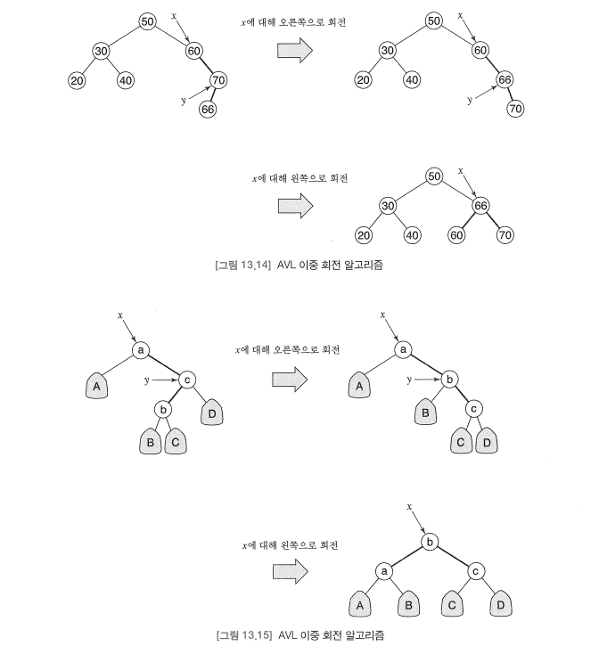
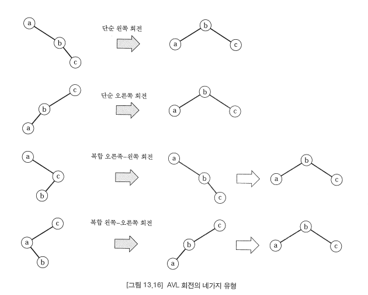
- 단순 회전을 수행할지 복합 회전(오른쪽 - 왼쪽 회전 연산)을 수행할지는 불균형을 야기하는 패턴에 따라 결정된다. 
- AVL 트리에서 균형 제어는 각각의 노드에서 두 서브트리의 높이가 1 이상 차이 나지 않는다는 AVL 특성(criterion)을 지키는 것에 의해 이루어진다. 
- 이 특성은 서브트리의 높이에 대해서만 정의되었기 때문에 AVL 트리를 높이-균형 트리(height-balanced tree)라고도 부른다.

## AVL 트리의 구현
```java
public class AVLTree {
    private int key, height;
    private AVLTree left, right;
 
    public static final AVLTree NIL = new AVLTree();
    
    public AVLTree(int key) {
        this.key = key;
        left = right = NIL;
    }
    
    public boolean add(int key) {
        int oldSize = size();
        grow(key);
        return size() > oldSize;
    }
    
    public AVLTree grow(int key) {
        if (this == NIL) return new AVLTree(key);
        if (key == this.key) return key; // prevent key duplication
        if (key < this.key) left = left.grow(key);
        else right = right.grow(key);
        rebalance();
        height = 1 + Math.max(left.height, right.height);
        return this;
    }
    
    public int size() {
        
        if (this == NIL) return 0;
        return 1 + left.size() + right.size();
    }
    
    public String toString() {
        
        if (this == NIL) return "";
        return left + " " + key + " " + right;
    }
    
    private AVLTree() {         // constructs the empty tree
        left = right = this;
        height = -1;
    }        
    
    private AVLTree(int key, AVLTree left, AVLTree right) {
        
        this.key = key;
        this.left = left;
        this.right = right;
        height = 1 + Math.max(left.height, right.height);
    }
    
    private void rebalance() {
        
        if (right.height > left.height + 1) {
           
            if (right.left.height > right.right.height) right.rotateRight();
            rotateLeft();
        }
        else if (left.height > right.height + 1) {
            
            if(left.right.height > left.left.height) left.rotateLeft();
            rotateRight();
        }
    }
    
    private void rotateLeft() {
        
        left = new AVLTree(key, left, right.left);
        key = right.key;
        right = right.right;
    }
    
    private void rotateRight() {
        right = new AVLTree(key, left.right, right);
        key = left.key;
        left = left.left;
    }
}
```

## 피보나치 트리
- 피보나치 트리는 피보나치 수를 생성하는 것과 동일한 순환적인 아이디를 사용하여 만들어진다. 
- 이 트리는 최악의 경우 AVL 트리가 된다. 
- 피보나치 트리는 AVL 특성을 만족하며, 주어진 높이에서 AVL 특성을 만족하는 모든 이진 트리 중에서 최소 크기를 가진다.
- 먼저, h는 피보나치 트리 T<sub>h</sub>의 높이가 된다. 
  - 이는 T<sub>h</sub>가 T<sub>h-1</sub>과 T<sub>h-2</sub>를 서브트리로 가지는 루트 노드가 되도록 정의되기에 귀납적으로 참이 된다.
- AVL 특성에 따르면 트리에 있는 어떤 노드의 두 서브트리의 높이도 1 이상 차이가 나서는 안 된다. 
  - 이는 처음 두 피보나치 트리인 T<sub>0</sub>과 T<sub>1</sub>의 경우 명백하게 참이다. 
  - 또한, 다른 모든 피보나치 트리가 높이 h-1과 h-2를 서브트리로 가지는 루트 노드가 되도록 정의되기 때문에 귀납적으로 참이다. 
- 각각의 피보나치 트리가 최소라는 것을 보이려면, 다시 한 번 귀납적으로 논증해야 한다. 
  - T<sub>0</sub>과 T<sub>1</sub>은 이것들보다 높이가 작은 이진 트리가 없기 때문에 모두 최소이다. 
  - 다음으로, T가 높이 h > 1 이고 크기 n < n<sub>h</sub>인 AVL 트리라고 가정한다면, 여기서 n<sub>h</sub>는 높이가 h인 피보나치 트리 T<sub>h</sub>의 크기이다.
    - L과 R을 T의 왼쪽과 오른쪽 서브트리라고 하고, h<sub>L</sub>과 h<sub>R</sub>을 각각 이것들의 높이, n<sub>L</sub>과 n<sub>R</sub>을 각각의 크기라고 가정한다. 
    - 그렇다면 h<sub>L</sub> = h -1이 되거나, h<sub>R</sub> = h - 1이 된다. (아니라면, T의 높이는 h보다 작을 것이기 때문이다.)
    - 일단 h<sub>L</sub> = h - 1이라고 가정한다면, L은 높이가 h - 1인 AVL 트리가 된다. 
    - 그러면 귀납적 가설에 의해 h보다 작은 높이를 가지는 어떤 AVL 트리도 최소한 같은 높이를 가지는 피보나치 트리와 같은 수의 원소를 가져야 하므로, n<sub>L</sub> |T<sub>h-1</sub>|(T<sub>h-1</sub>의 크기)이 된다.
- T는 AVL 트리이므로, 이것의 두 서브트리의 높이는 1 이상 차이날 수 없다. 
- 따라서 L은 높이가 h - 1 또는 h - 2인 AVL 트리이므로, 다시 한 번 귀납적 가설에 의해 n<sub>R</sub> >= |T<sub>h-2</sub>|가 된다. 
- 그러므로 T의 크기는 |T| = 1 + n<sub>L</sub> + n<sub>R</sub> + n<sub>R</sub> >= 1 + |T<sub>h-1</sub>| + |T<sub>h-2</sub>| = |T<sub>h</sub>|가 되므로, T<sub>h</sub>가 최소라는 것이 증명된다.
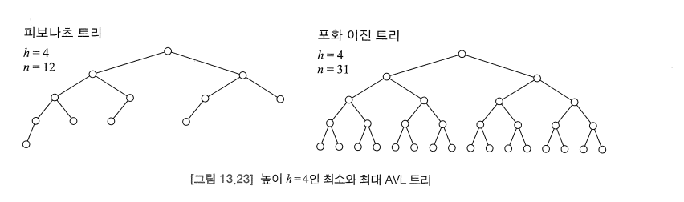

## 다원 탐색 트리
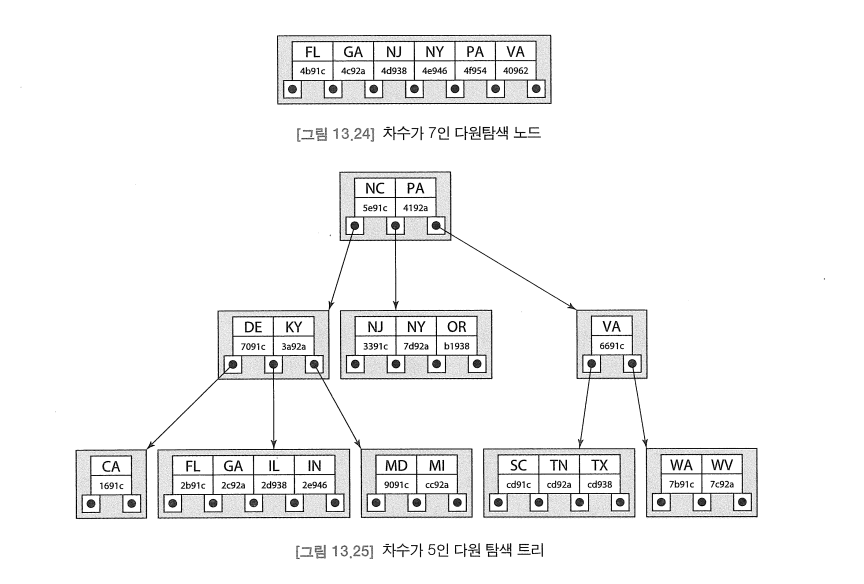
```java
public class MST {
    
    private class Node {
    
        int degree;
        Comparable[] keys;
        DiskAddress[] locs;
        Node[] kids;
    
        Node(int m) {
            keys = new String[m - 1];
            locs = new DiskAddress[m - 1];
            kids = new Node[m];
        }
    }
    
    private int degree;
    private Node root;
    
    public MST(int m) {
        
        degree = m;
        root = new Node(M);
    }
}
```

## B-트리
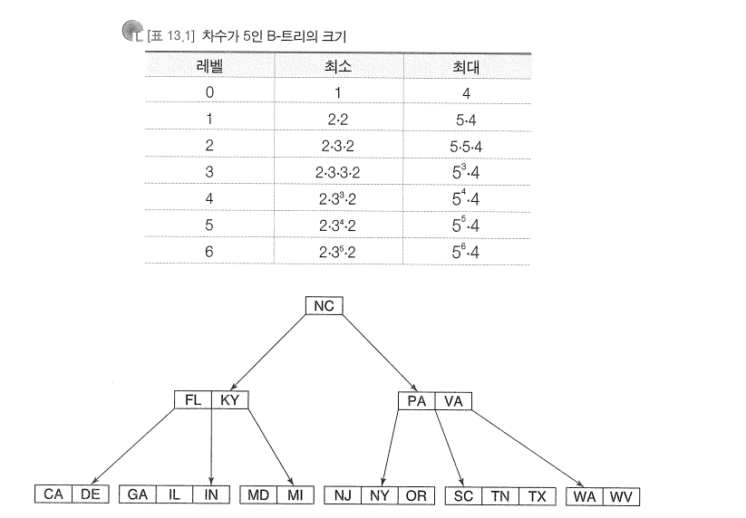
- BST와 마찬가지로, MST는 매우 불균형하게 될 수 있으므로 접근 시간의 심각한 저하를 초래할 수 있다.
- AVL 트리는 BST의 문제를 해결하는 하나의 솔루션을 제공한다. 
- 이것은 서브트리의 높이를 거의 동일하게 유지시키는 회전에 의해 제어되는, 하향식(top-down) 솔루션이다. 
- MST의 균형을 유지하는 가장 좋은 솔루션은 상향식(bottom-up) 방법이다. 
- 이는 모든 리프를 동일한 레벨에서 유지하기 위해 노드에 대한 분할(split)과 결합(join) 연산을 구현한다. 
- 위와 같은 구조를 B-트리라고 부른다.
- 차수가 m인 B-트리는 다음을 만족하는 차수가 m인 다원 탐색 트리이다.
  - 모든 리프 노드는 동일한 레벨에 있다
  - 루트가 아닌 모든 내부 노드는 최소한 [m/2]의 차수를 가진다. 
    - 위 조건은 B-트리에 대한 삽입과 삭제 연산의 직접적인 결과다.
- 차수가 m이고 높이가 h 인 B-트리의 키의 개수 n의 범위는 다음과 같다.
  - 2[m/2]<sup>h</sup> - 1 <= n <= m<sup>h+1</sup> - 1
- 크기가 n이고 차수가 m인 B-트리의 높이 h의 범위는 다음과 같다.
  - h <= log<sub>m/2</sub>n = O(log(n))
- 이는 B-트리가 로그 접근 시간을 가진다는 것으 ㄹ의미한다.
- B-트리는 데이터베이스 테이블을 위한 외부 인덱스를 구현하는데 사용되는 표준 자료 구조이다. 
  - 각각의 키는 키의 레코드에 대한 디스크 주소를 가지고 있다.
  - B-트리의 차수는 각 노드가 하나의 디스크 블록에 저장될 수 있는 값으로 선택된다. 
  - 따라서 어떤 레코드를 접근하기 위해 필요한 디스크 판독 횟수는 결코 h + 2를 넘지 않는다.
