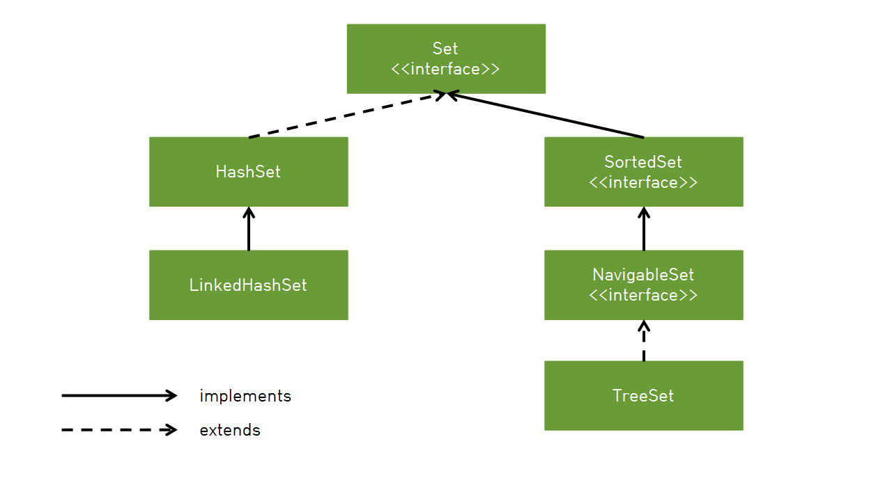

# 집합(Set)

### 집합(Set)

- 집합과 관련된 것을 쉽게 처리하기 위해 만든 것으로 HashSet, TreeSet, LinkedHashSet 등이 있다.
- 순서에 상관 없이 어떤 데이터가 존재하는지 확인하는 용도로 많이 사용

### 집합 자료형의 2가지 특징

1. 중복을 허용하지 않는다.
    
    → 중복을 허용하지 않기 때문에 자료형의 중복을 제거하기 위한 필터 역할로도 사용된다. 
    
2. 순서가 없다.
    
    → 리스트나 배열은 순서가 있기 때문에 인덱싱을 통해 자료형의 값을 얻을 수 있지만 집합 자료형은 순서가 없기 때문에 인덱싱으로 값을 얻을 수 없다.
    
    → 인덱스로 객체를 관리하지 않기 때문에 데이터를 검색하기 위해서는 iterator() 메서드로 Iterator(반복자)를 생성하고 데이터를 가져와야 한다.
    
    → 집합에 입력한 순서대로 데이터를 가져오거나 오름차순으로 정렬된 데이터를 가져오고 싶은 경우 TreeSet과 LinkedHashSet을 사용한다.
    

```java
HashSet<String> set = new HashSet<>(Arrays.asList("H", "e", "l", "l", "o"));

System.out.println(set);  //  [e, H, l, o] 출력
```

### Set을 사용하는 이유

- 고유성 보장 : 데이터를 추가하기 전에 중복 항목 제거
- 수학적 집합 연산 가능 : 수학적 집합 연산(합집합, 교집합)을 편하게 할 수 있는 데이터 포함
- 효율적인 테스트 : 해싱을 사용하여 요소를 구성하므로 Set 내에서 항목 존재 여부를 테스트하기에 효율적
- List에서 중복 제거 : List를 Set으로 변환하고 다시 List로 변환 시 중복 요소를 제거하고 요소의 순서 유지



### **HashSet<E>**

- Set 컬렉션 클래스에서 가장 많이 사용되는 클래스 중 하나
- 순서가 필요없는 데이터를 hast table에 저장
- Set중에 가장 성능이 좋음

```java

// 기본 설정 용량을 0.75이며 저장공간의 75%가 채워졌을 때 용량이 두 배로 늘어난다.
Set<String> set = new HashSet<String>(); 

// add 순서를 변경해도 출력하는 순서는 바뀌지않는다.
// 중복된 요소 추가 시 false 반환 
// 자료형이 다르면 다른 자료로 간주 ex) "1", 1
set.add("apple");
set.add("banana");
set.add("pyopyo");

// addAll() : 한번에 여러 값 추가
set.add("pear", "blueberry", "lemon")

Iterator<String> it = set.iterator(); // Iterator(반복자) 생성

	while (it.hasNext()) { // hasNext() : 데이터가 있으면 true 없으면 false
		System.out.println(it.next()); // next() : 다음 데이터 리턴
	}

// remove() : 데이터 제거
set.remove("apple");

// claer() : 전체 데이터 삭제
set.clear();

// contains() : 데이터를 포함하고 있는지 확인
set.contains("apple")

// isEmpty() : Set이 비어있는지 확인
set.isEmpty();

```

### LinkedHashSet

- 중복된 데이터를 저장할 수 없지만 입력된 순서대로 데이터를 관리
- 연결된 목록 타입으로 구현된 hash table에 데이터 저장
- 셋 중 가장 느림

```java
Set<String> set = new LinkedHashSet<String>();

// 중복 값 제외하고 순서대로 저장
set.add("1");
set.add("1");
set.add("2");
set.add("3");

Iterator<String> it = set.iterator();
		while (it.hasNext()) {
				System.out.println(it.next()); // 출력 결과 : [1, 2, 3]
		}
```

### TreeSet

- 중복된 데이터를 저장할 수 없고 입력된 데이터를 오름차순으로 정렬해서 관리
- 이진 탐색 트리라는 자료구조의 형태로 데이터를 저장하며 red-black tree 타입으로 값이 저장됨
    
    → 이진 탐색 트리는 왼쪽에는 부모 노드의 값보다 작은 값의 자식 노드를, 오른쪽에는 큰 값의 자식 노드를 저장하는 이진 트리
    
    → red-black tree : 트리 노드에 빨간색 혹은 검정색을 나타내는 색상 속성을 갖고 있는 이진 탐색 트리
    

```java
class TreeNode {
	TreeNode left;        // 왼쪽 자식노드
	Object element;       // 객체를 저장하기 위한 참조변수
	TreeMode right;       // 오른쪽 자식노드
}
```

- Hash Set보다 성능이 느림
- TreeSet에 객체 저장 시 저장되는 객체가 Comparable을 구현하거나 TreeSet에게 Comparator를 제공해서 두 객체를 비교할 방법을 알려주어야함

```java
Set<Integer> set = new TreeSet<Integer>();

set.add(4); // 데이터 추가
set.add(2);
set.add(1);
set.add(3);
set.add(1);
set.add(3);

Iterator<Integer> it = set.iterator(); // 반복자 생성

while (it.hasNext()) {
	System.out.println(it.next());  // 출력 결과 : [1, 2, 3, 4]
}

```