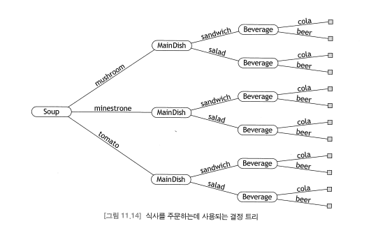
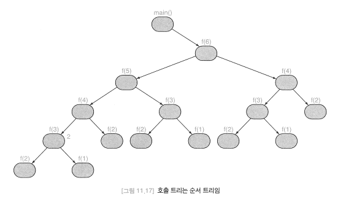
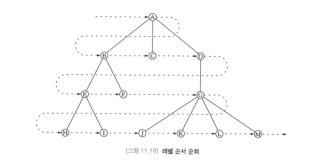
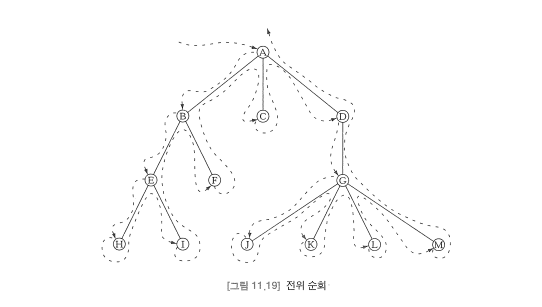

# 트리(Tree)

- 트리는 어떤 속성을 만족하는 노드와 방향 간섭으로 정의될 수 있다.
- 또한, 트리는 하나의 노드가 루트를 가리키고 있는 사이클이 없는 그래프로도 정의될 수 있으며, 순환적으로 정의될 수도 있다. 
- 개념적으로 트리는 다양한 점으로부터 가지가 뻗어 있는 계층 구조를 가지고 있다. 
- 트리는 트리의 시작점(root), 루트로 부터 뻗은 가지(edge), 가지로 연결되는 노드(node)로 이루어진다.
- 한 노드가 다른 노드의 부모가 되는 경우 이 두 노드는 인접한다고 하며, 트리에서 경로(edge)는 인접 노드의 시퀸스다.
- 어떤 노드에 이르는 루트 경로(root path)는 루트로부터 해당 노드까지의 유일한 경로다. 
  - 루프-리프 경로(root-to-leaf path)는 리프 노드에 이르는 루트 경로이다. 
- 경로의 길이(length)는 부모-자식 쌍의 개수로 정의되며, 노드의 개수보다 하나 적게 된다. 
- 트리의 크기(size)는 노드의 개수이다. 공백 트리(empty tree)는 크기가 0인 유일한 트리이며, 단독(singleton) 트리는 크기가 1인 트리이다. 
- T1의 모든 노드가 T2의 노드이고, T1에 있는 y의 부모인 x가 동시에 T2에 있는 y의 부모일 때, 트리 T1은 트리 T2의 서브트리(subtree)라고 한다. 
  - 역인 T2는 트리 T1의 슈퍼트리(supertree)가 된다.
- 노드의 깊이(depth)는 해당 노드의 루트 경로의 길이이다. 
- 트리의 노드는 레벨(level)로 구분될 수 있으며, 각각의 레벨은 주어진 깊이에 있는 모든 노드로 구성되어 있다. 
- 트리의 경로 길이(path length)는 트리에 있는 모든 노드에 대한 깊이의 합이다. 
  - 이는 가중치의 합으로 계산될 수 있으며, 레벨별로 각각의 레벨에 있는 노드의 수를 곱하거나 노드 별로 그것의 레벨을 모두 더한다.
- 트리의 너비(width)는 최대 레벨의 크기이다. 
- 트리의 외형(shape)는 트리의 높이와 너비에 의해 측정된다. 
- 공백이 아닌 트리의 차수는 노드들의 차수 중에서 최대 차수이다. 
- 만일 모든 리프가 같은 레벨에 있고 모든 노드가 동일한 차수를 가지고 있다면 이를 포화 트리(full tree)라고 한다. 
  - 이 경우 각 노드의 차수는 트리의 차수와 같다. 
- 리프가 아닌 노드를 내부 노드(internal node)라고 부른다. 

## 트리의 순환 정의
- 트리는 본질적으로 순환 구조이다. 트리에 대한 순환 정의는 다음과 같다.
    > 트리는 공집합이거나, r이 노드이고 S가 서로 분리된 트리의 집합일 때, 어떤 트리도 r을 포함하지 않는 쌍(r, S)이다. 
    > 노드 r을 트리의 루트(root)라고 부르고, S에 있는 트리를 서브트리(subtree)라고 부른다.
- 위와 같은 순환적 관점에 따라 트리의 특성을 재정의하면 다음과 같다.
  - x가 트리의 루트이고 y가 서브트리 중 하나의 루트라면 노드 x는 노드 y의 부모(parent)다.
  - 이 경우 y는 x의 자식이라고 할 수 있다. 
  - 위와 같은 부모와 자식의 기본 개념에 따라 정의되는 다른 모든 용어(조상, 후손, 리프, 높이, 레벨 등)은 동일한 방식으로 정의될 수 있다. 
- 트리의 순환 정의는 시퀸스가 아니라 서브트리의 집합을 명세한다. 즉, 서브트리의 차수와는 무관하다.

```java
import java.util.Iterator;

class UnorderedTree {
    private Object root;
    private Set subtrees;
    private int size;

    public UnorderedTree() {
    }// Constructs the empty tree

    public UnorderedTree(Object root) { // Constructs a singleton 
        this. (root);
        subtrees = new Set(); // Constructs the empty set
        size = 1;
    }

    public UnorderedTree(Object root, Set trees) {
        this(root);
        
        for (Iterator it = trees.iterator(); it.hasNext(); ) {

            Object object = it.next();
            
            if (Object instanceof UnorderedTree) {
                UnorderedTree tree = (UnorderedTree)object;
                subtrees.add(tree);
                size += tree.size();
            }
        }
    }
    
    public int size() {
        return size;
    }
    
}
```
## 결정 트리
- 결정 트리(decision tree)는 각각의 내부 노드는 결정 과정에서 결정이 내려지는 단계를 표현하고 서브트리는 그 단계에서의 대안을 표현한다.
- 

## 순서 트리
- 순서 트리를 위한 순환 정의는 무순서 트리를 위한 정의와 거의 비슷하다.
- 유일한 차이는 각각의 노드가 집합이 아니고 서브트리의 시퀸스를 가지고 있다는 것이다.
  > 순서 트리(ordered tree)는 공집합이거나 r이 노드이고 S가 서로 분리된 트리의 시퀸스일 때, 모든 트리가 r과 분리된 쌍(r, S)이다.


- 순서 트리는 정렬 트리와 같지 않다. 순서(ordered)라는 용어는 트리의 구조(structure)와 관련 있는 것이지, 그것의 내용과는 관계가 없다. 

### 순서 트리를 위한 순회 알고리즘
- 일반적인 순서 트리에서는 다음의 세 가지 주요 순회 알고리즘이 있다.
  - 레벨 순서(level order) 순회
    - 
    - 순서 트리의 레벨 순서 조회
      1. 큐를 초기화한다.
      2. 루트를 큐에 삽입한다. 
      3. 큐가 공백이 될 때까지 단계 4 ~ 6을 반복한다
      4. 큐에서 첫 번째 노드 x를 삭제한다
      5. x를 방문한다. 
      6. x의 모든 자식들을 순서대로 큐에 삽입한다. 
  - 전위(preorder) 순회 (루트 노드 우선)
    - 
    - 순회순서 트리의 순환 전위 순회 
      1. 루트를 방문한다. 
      2. 각 서브트리를 순서대로 전위 순회한다. 
  - 후위(postorder) 순회 (루트 노드 나중)
    - 순서 트리의 순환 후위 순회
      1. 각 서브트리를 순서대로 후회 순회한다.
      2. 루트를 방문한다.
- 위의 세 가지 순회 알고리즘은 모두 O(n) 시간에 실행된다. 
  - => 각각의 노드는 정확히 한번만 처리된다. 

