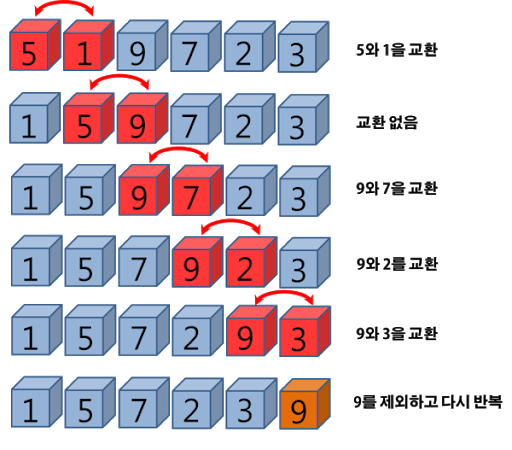

# 정렬(Sort)

## 정렬 알고리즘

- ‘데이터’를 ‘특정한 기준에 따라 순서대로 정렬’하는 알고리즘

### 알고리즘의 종류

| 정렬 알고리즘 | 정의 |
| --- | --- |
| 버블(bubble) | 데이터의 인접 요소끼리 비교하고, swap 연산을 수행하며 정렬하는 방식 |
| 선택(selection) | 대상에서 가장 크거나 작은 데이터를 찾아가 선택을 반복하면서 정렬하는 방식 |
| 삽입(insertion) | 대상을 선택해 정렬된 영역에서 선택 데이터의 적절한 위치를 찾아 삽입하면서 정렬하는 방식 |
| 퀵(quick) | pivot 값을 선정해 해당 값을 기준으로 정렬하는 방식 |
| 병합(merge) | 이미 정렬된 부분 집합들을 효율적으로 병합해 전체를 정렬하는 방식 |
| 기수(radix) | 데이터의 자릿수를 바탕으로 비교해 데이터를 정렬하는 방식 |

---

### 버블정렬

- 두 인정합 데이터의 크기를 비교해 정렬하는 방법
- 시간복잡도 : $O(n^2)$
    - 다른 정렬 알고리즘보다 속도가 느린 편
- 루프를 돌면서 인접한 데이터 간의 swap연산으로 정렬

<aside>
💡 버블정렬 과정

1. 비교 연산이 필요한 루프 범위 설정
2. 인접한 데이터 값 비교
3. swap 조건에 부합하면 swap 연산 수행
4. 루프 범위가 끝날 때까지 2-3 반복
5. 정렬 역역 설정 → 이 영역은 다음 루프에서 제외
6. 비교 대상이 없을 때까지 1-5 반복

</aside>

---

### 선택정렬

- 대상 데이터에서 최대나 최소 데이터를 데이터가 나열된 순으로 찾아가며 선택하는 방법
- 시간복잡도 : $O(n^2)$

<aside>
💡 선택정렬 과정

1. 남은 정렬 부분에서 최솟값 또는 최댓값을 탐색
2. 남은 정렬 부분에서 가장 앞에 있는 데이터와 선택된 데이터를 swap
3. 가장 앞에 있는 데이터의 위치를 변경해(index++) 남은 정렬 부분의 범위를 축소
4. 전체 데이터 크기만큼 index가 커질 때까지(남은 정렬 부분이 없을 때까지) 반복

</aside>

---

### 삽입정렬

- 이미 정렬된 데이터 범위에 정렬되지 않은 데이터를 적절한 위치에 삽입시켜 정렬
- 시간복잡도 : $O(n^2)$
- 선택 데이터를 현재 정렬된 데이터 범위 내에서 적절한 위치에 삽입

<aside>
💡 삽입정렬 방법

1. 현재 index에 있는 데이터 값 선택
2. 현재 선택한 데이터가 정렬된 데이터 범위에 삽입될 위치 탐색
3. 삽입 위치부터 index에 있는 위치까지 shift 연산 수행
4. 삽입 위치에 현재 선택한 데이터를 삽입하고 index++ 연산 수행
5. 전체 데이터의 크기만큼 index가 커질 때까지(선택할 데이터가 없을 때까지) 반복

</aside>

---

### 퀵정렬

- 기준값을 선정해 해당 값보다 작은 데이터와 큰 데이터로 분류
- 시간복잡도 : $O(nlogn)$
- pivot을 중심으로 계속 데이터를 2개의 집합으로 나누면서 정렬

<aside>
💡 퀵정렬 방법

1. 데이터를 분할하는 pivot을 설정
2. pivot을 기준으로 데이터를 2개의 집합으로 분리
   2-1. start가 가리키는 데이터가 pivot보다 작으면 start를 오른쪽으로 이동
   2-2. end가 가리키는 데이터가 pivot이 카리키는 데이터보다 크면 end를 왼쪽으로 이동
   2-3. start가 가리키는 데이터가 pivot보다 크고, end가 가리키는 데이터가 pivot보다 작으면 start, end가 가리키는 데이터를 swap하고 start는 오른쪽, end는 왼쪽으로 이동
   2-4. start와 end가 만날 때까지 2.1 - 2.3 반복
   2-5. start와 end가 만나면 만난 지점의 데이터와 pivot을 비교하여 pivot보다 크면 오른쪽에 작으면 왼쪽에 pivot의 값 저장
3. 분리 집합에서 각각 다시 pivot 설정

</aside>

---

### 병합정렬

- 분할과 정복 방식을 사용해 데이터를 분할하고 분할한 집합을 정렬하여 합치는 알고리즘
- 시간복잡도 : $O(nlogn)$

<aside>
💡 병합정렬 방법
- 투 포인터 개념을 사용하여 왼쪽, 오른쪽 그룹을 병합
- 왼쪽 포인터와 오른쪽 포인터의 값을 비교하여 작은 값을 결과 배열에 추가하고 포인터를 오른쪽으로 한 칸 이동

</aside>

---

### 기수정렬

- 값을 비교하지 않는 특이한 정렬
- 값을 놓고 비교할 자릿수를 정한 다음 해당 자릿수만 비교
- 시간복잡도 : $O(kn)$
    - k : 데이터의 자릿수
- 시간복잡도가 가장 짧으므로 정렬 해야하는 데이터의 수가 많은 경우 유리

<aside>
💡 기수정렬 방법
- 10개의 큐를 이용 ( 각 큐는 값의 자릿수를 대표) → 0 ~ 9의 큐 존재
- 1의 자릿수를 기준으로 먼저 데이터를 정렬하고 이후 10의 자릿수, 100의 자릿수 … 순으로 마지막 자릿수를 기준으로 정렬할 때 까지 반복

</aside>