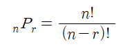

# 순열

## 순열(Permutation)

- 서로 다른 n 개에서 r(r≤n)개를 택하여 일렬로 나열하는 것을 n 개에서 r 개를 택하는 순열이라 하고, 이 순열의 수를 기호 $nPr$ 로 나타낸다.
- 시간복잡도 : $O(n!)$



```java
  int[] arr = {1, 2, 3}; //순열을 만들 배열 
	int n = arr.length; //배열의 길이 
	int[] output = new int[n]; //순열 출력을 위한 배열 
	boolean[] visited = new boolean[n]; //중복해서 뽑지 않기 위해 방문했는지를 체크하는 배열 

	//1. Swap 함수를 이용해 구현 
	per1(arr, 0, n, 3);

//1. Swap 함수를 이용해 구현 - 순서 없이 n 개중에서 r 개를 뽑는 경우
static void per1(int[] arr, int depth, int n, int r) {
	if(depth == r) {
		print(arr, r);
		return;
	}

	for(int i=depth; i<n; i++) {
		swap(arr, depth, i);
		per1(arr, depth + 1, n, r);
		swap(arr, depth, i);
	}
}

static void swap(int[] arr, int depth, int i) { //두 배열의 값을 바꾸는 Swap 함수 
	int temp = arr[depth];
	arr[depth] = arr[i];
	arr[i] = temp;
}

	//2. DFS를 이용해 구현 
	per2(arr, output, visited, 0, n, 3); //r = 3, 3개를 뽑을 것

//2. DFS를 이용해 구현  - 순서를 지키면서 n 개중에서 r 개를 뽑는 경우
static void per2(int[] arr, int[] output, boolean[] visited, int depth, int n, int r) {
	if(depth == r) {
		print(output, r); //순열 출력을 위한 print 함수 
		return;
	}

	for(int i = 0; i < n; i++) {
		if(visited[i] != true) {
			visited[i] = true;
			output[depth] = arr[i];
			per2(arr, output, visited, depth + 1, n, r);    
			visited[i] = false;
		}
	}
}

// 순차적인 숫자만으로 이루어진 순열을 구할 경우
public static void per3(int depth, int r) {
	if(depth == r) {
		// 순열 출력 
		for(int n : output) {
			System.out.print(n + " ");
		}
		System.out.println();
		
		return;
	}
		
	for(int i = 0; i < 4; i++) { // 0, 1, 2, 3 숫자 중에서 r개의 순열을 뽑음 
		output[depth] = i;
		per3(depth+1, r);
	}
}
```

## 중복순열

- 서로 다른 n개의 원소에서 중복을 허용하여 r개를 택하여 일렬로 배열하는 순열

$$
n∏r=n^r
$$

## 원순열

- 서로 다른 원소를 원형으로 배열하는 순열

$$
n!/n=(n-1)!
$$

## 같은 것이 있는 순열

- n개 중에서 서로 같은 것이 각각 p개, q개 ~ r개씩 있을 때, n개를 모두 일렬로 배열

$$
n!/(p!q!~r!)
$$