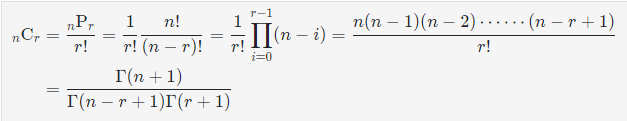

# 조합(Combination)

- 조합이란 n개의 원소를 갖는 집합에서 r개의 원소를 선택하는 것 혹은 선택의 결과로 정의된다. 
- 어떤 순서로 원소를 선택했는지는 중요하지 않으며, 이것이 순열(Permutation)과 다른 점이다.
- 집합의 크기<sup>원소의 개수</sup>가 n인 집합 S에 대해 r이 가지는 부분집합의 개수는 이항 계수(binomial coefficient)와 같으며, 각 부분집합을 n개에서 r개를 택하는 조합(combination)이라고 한다.
- 조합 <sub>n</sub>C<sub>r</sub>에 대한 경우의 수는 <sub>n</sub>C<sub>r</sub> / r! 이 된다.
- 
  - 즉, r개의 원소를 갖는 어떤 조합 (어떤 r- 부분 집합)에서의 가능한 순열의 수가 r!이고, 
  - 각 조합(다른 조합은 다른 원소 구성을 가진다.)의 모든 순열의 경우를 다 더한 결과가 n개에서 r개를 선택하는 순열의 경우의 수이기에, 위 수식의 첫 번째 등식이 성립한다.

## 조합의 성질 
- <sub>n</sub>C<sub>r</sub> = <sub>n</sub>C<sub>n-r</sub>
- <sub>n</sub>C<sub>r</sub> = <sub>n-1</sub>C<sub>r</sub> + <sub>n-1</sub>C<sub>r-1</sub> 

## 구현
```java
public class Combination {
    public static void main(String[] args) {
        int[] arr = {1, 2, 3}; //조합을 만들 배열 
        boolean[] visited = new boolean[arr.length];
 
        //1. 백트래킹을 이용해 구현
        System.out.println("-------- 1. 백트래킹 ---------");
    
        for(int r = 1; r <= arr.length; r++) {
        	System.out.println("\n" + arr.length + "개 중에 " + r  + "개 뽑음");
            comb1(arr, visited, 0, r);
        }
        
        //2. 재귀를 이용해 구현
        System.out.println("\n---------- 2. 재귀 ----------");
        
        for(int r = 1; r <= arr.length ; r++) {
        	System.out.println("\n" + arr.length + "개 중에 " + r  + "개 뽑음");
            comb2(arr, visited, 0, r);
        }
    }
 
    //1. 백트래킹을 이용해 구현
    static void comb1(int[] arr, boolean[] visited, int start, int r) {
        if(r == 0) {
            print(arr, visited);
            return;
        } else {
            for(int i = start; i < arr.length; i++) {
                visited[i] = true;
                comb1(arr, visited, i + 1, r - 1);
                visited[i] = false;
            }
        }
    }
 
    //2. 재귀를 이용해 구현
    static void comb2(int[] arr, boolean[] visited, int depth, int r) {
        if(r == 0) {
            print(arr, visited);
            return;
        }
        if(depth == arr.length) {
            return;
        } else {
            visited[depth] = true;
            comb2(arr, visited, depth + 1, r - 1);
 
            visited[depth] = false;
            comb2(arr, visited, depth + 1, r);
        }
    }
 
    // 배열 출력
    static void print(int[] arr, boolean[] visited) {
        for(int i = 0; i < arr.length; i++) {
            if(visited[i] == true)
                System.out.print(arr[i] + " ");
        }
        System.out.println();
    }

}
```