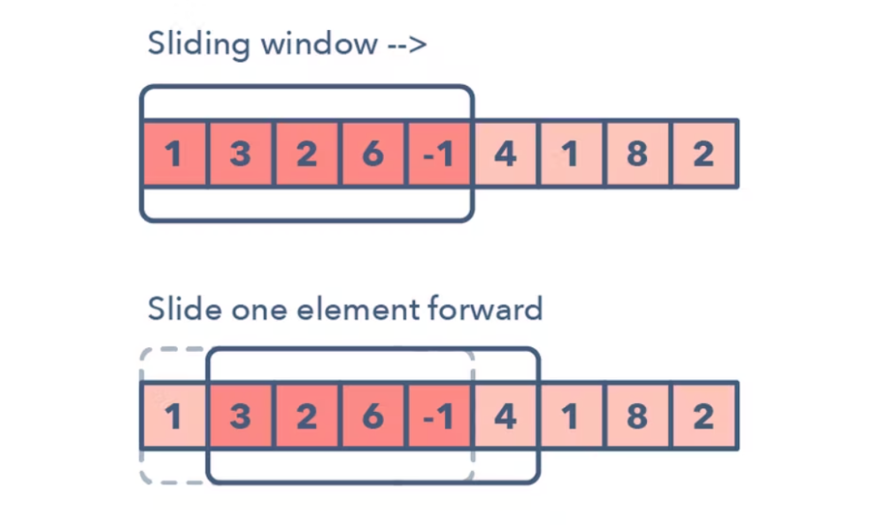

# Sliding Window

- Window(특정 범위)가 있을 때, 윈도우 내부 요소의 값을 이용하여 문제를 풀이하는 알고리즘이다.
- 특정한 조건에 따라 Window가 커지거나 닫히거나, 새로 생성될수도 있다.
- Window에 0번 인덱스부터 N번 인덱스 까지의 합을 저장한다.
- 고정적인 범위를 탐색할 때, 유용하다.
- 중복으로 연산을 제거하면서 효율을 높일 수 있다.

# 예시) JS코드

```JavaScript
const solution = (arr, N) => {
	let window = 0;
	let maxSum = 0;
	
	if (arr.length < N) return null;

	for (let i = 0; i < N; i++) // N가지 숫자를 window에 더한다.
		window += arr[i];

	maxSum = window; // maxSum에 window를 복사해 보관해두고

	for (let i = N; i < arr.length; i++) { // window까지 더했던 인덱스의 다음인덱스를 시작점으로 loop
		window += arr[i] - arr[i - N]; // 바로 앞 인덱스 값은 빼고, 바로 다음 인덱스 값은 더한다.
		maxSum = Math.max(maxSu, window); // maxSum과 window를 비교해서 더 큰값을 maxSum에 할당한다.
	}
	return maxSum;
}
```