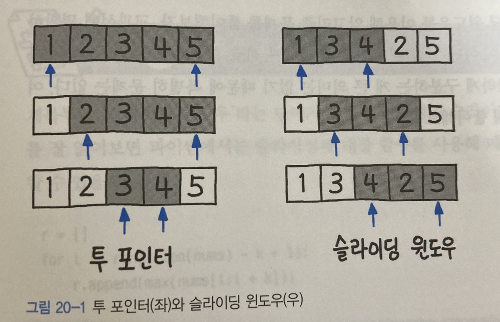

# Sliding Window

- 고정 사이즈의 윈도우가 이동하면서 윈도우 내에 있는 데이터를 이용해 문제를 풀이하는 알고리즘이다.
- 교집합의 정보를 공유하고, 차이가 나는 양쪽 끝 원소만 갱신한다.
- 배열이나 리스트 요소의 일정 범위 값을 비교할 때 사용하면 유용하다.
- 투 포인터 알고리즘과 연동하여 많이 사용된다. 
  - 1차원 배열이 있고, 이 배열에서 각자 다른 원소를 가리키는 2개의 포인터를 조작하여 원하는 값을 얻는 형태다.
- 주된 사용처는 다음과 같다.
  - 연속된 데이터에서 최댓값/최솟값 찾기
  - 평균, 중간값 계산
  - 패턴 검색(EX; 문자열 내 서브스트림 찾기)
  - 네트워크 통신에서의 데이터 전송 관리
- 투 포인터 알고리즘과 유사하게 부분 배열들을 활용하여 특정 조건을 일치시키지만, 부분 배열의 길이(크기)가 고정적이라는 차이가 있다. 
- 선형 시간(1차원 배열)을 2회 이상 반복적으로 탐색할 경우 O(N<sup>2</sup>)의 시간 복잡도를 O(N)으로 줄일 수 있다.

# sudo 코드
```java
class SlidingWindow {
    
    // n 길이의 배열 arr에서 k 만큼의 윈도우 길이의 합계 중 최댓값/최솟값을 구한다.
	private static int[] maxAndMinSum(int arr[], int n, int k) {

		int maxSum = Integer.MIN_VALUE;
        int minSum = Integer.MAX_VALUE;

        // i부터 시작하는 arr 배열의 전체 탐색 (n - K + 1)까지
		for (int i = 0; i < n - k + 1; i++) {
            
			int currentMaxSum = 0;
            int currentMinSum = 0;
            
			for (int j = 0; j < k; j++) {
      
                // 누적 합
                currentMaxSum = currentMaxSum + arr[i + j];
                currentMinSum = currentMinSum + arr[i + j];
      
            }

            // 최댓값, 최솟값
			maxSum = Math.max(currentMaxSum, maxSum);   
            minSum = Math.min(currentMinSum, minSum);
		}

        // 배열 만들어 return
		return new int[]{maxSum, minSum};
	}

	// Driver code
	public static void main(String[] args) {
        
		int arr[] = { 1, 4, 2, 10, 2, 3, 1, 0, 20 };
		int k = 4;
		int n = arr.length;

        int[] answer = maxAndMinSum(arr, n, k);
		System.out.println("최댓값 : " + answer[0]);   // 최댓값 : 24
        System.out.println("최솟값 : " + answer[1]);   // 최솟값 : 6
	}
}

```