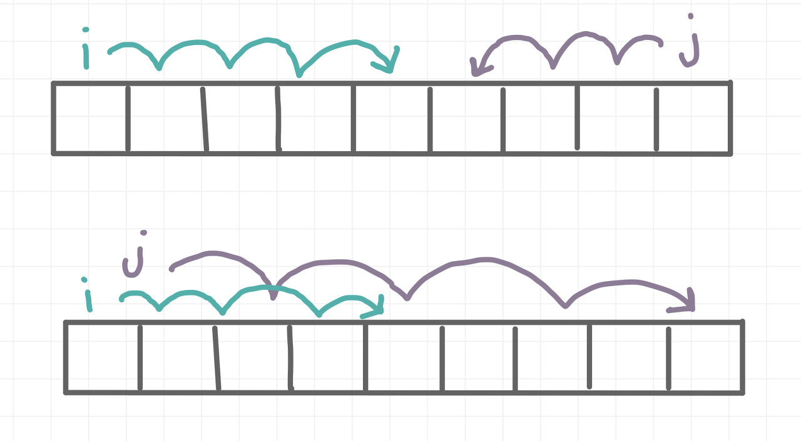

# 투포인터

## Two-Pointer

- 투 포인터 : 1차원 배열에서 각자 다른 원소를 가리키고 있는 2개의 포인터를 조작하며 원하는 값을 찾을 때까지 탐색한다.
- 보통 포인터의 시작 위치는 2가지이다.
    - 배열의 첫번째 인덱스와 마지막 인덱스(반대방향)
    - 둘 다 첫번째 인덱스(같은방향)



- 이중 for문 사용시 시간복잡도는 $O(N^2)$지만 투 포인터 사용 시 $O(N)$으로 단축시킬 수 있다.

```java
// 반대방향 포인터
int s=0, e=n-1, min=Integer.MAX_VALUE;
		Arrays.sort(arr);
		while(s < e) {
			int sum = arr[s]+arr[e];
			
			if(min> Math.abs(sum)) {
				min = Math.abs(sum);
				
				res[0] = arr[s];
				res[1] = arr[e];
				
				if(sum==0) break;
			}
			
			if(sum <0) s++;
			else e--;
		}

// 같은방향 포인터
public static int[] twoPointers(int[] arr, int target) {
        int start = 0;
        int end = 0;

        int sum = 0;
        int[] result = {-1, -1};

        while(true){
            if (sum > target){
                sum -= arr[start++];
            } else if (end == arr.length){
                break;
            } else{
                sum += arr[end++];
            }

            if (sum == target){
                result[0] = start;
                result[1] = end - 1;
                break;
            }
        }

        return result;
    }
```