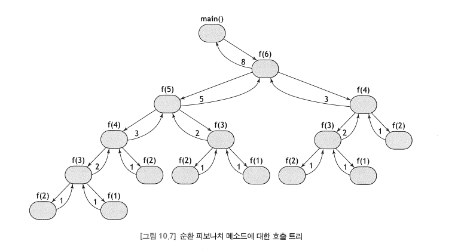

# 재귀 (Recursive)

- 순환 함수(recursive function)는 자기 자신을 호출하는 함수다. 
- 이 함수는 가상의 루프를 사용 하여 자동으로 반복 된다.
- 순환 함수는 보통 반복적인 것에 비해 더 간결하다. 
- 순환이 제대로 작동하기 위해서는 반드시 직접 계산에 의해 순환 사다리를 다시 올라갈 수 있도록 만들어 주는 베이스(base)를 가지고 있어야 한다. 
  - 일반적인 프로그래밍 오류 중의 하나는 베이스를 잊어버리는 것으로, 이럴 경우 run-time error인 무한 순환(Infinite recursion)에 빠지게 된다. 
  - 이러한 오류를 막기 위해, 다음과 같이 순환가 베이스를 명시적으로 구분하기도 한다. 
    - n != 1, if n = 0 or 1 [베이스]
      - n != n(n-1)!    [순환]
- 순환적 사고의 핵심 아이디어는 크기가 n인 문제를 풀기 위해 크기가 n보다 작은 동일한 문제에 대한 솔루션을 먼저 찾는 것이다. 

### Factorial
```java
class TestRecursiveFactorial {
    public static void main(Strig[] args) {
        
        for (int i = 0; i < 10; i++) {
            System.out.println(i + "\t" + factorial(i));
        }
    }
    
    private static long factorial(int n) {
        
        if (n < 2) return 1;            // base
        return n * factorial(n - 1);    // recursion
    }
    
}
```

### Hanoi Towers
```java
class HanoiTowers {
    
    public static void main(String[] arsgs) {
        
        int numTowers = 3;
        if(args.length > 0) numTowers = Integer.parseInt(args[0]);
        print(numTowers, 'A', 'B', 'C');
    }
    
    private static void print(int n, char x, char y, char z) {
        
        // move n disks from peg x to peg y using peg z;
        if (n == 1) System.out.println(x + " --> " + y);    // base
      
        else {
            
            print(n - 1, x, z, y);                          // recursion
            System.out.println(x + " ---> " + y);
            print(n - 1, z, y, x);                          // recursion
        }
    }
}

```

### Fibonacci
```java

class TestRecursiveFibonacci {
    
    public static void main(String[] args) {

        for (int i = 0; i < 13; i++) {
            System.out.println(i + '\t' + f(i));
        }
    }
    
    private static long f(int n) {
    
        if (n < 1) return 0;                // base
        if (n < 3) return 1;                // base
        return f(n -1) + f(n - 2);          // recursion
            
    }
}
```

## 호출 트리
- 위 피보나치 함수의 경우 경과 시간이 지수적으로 증가되는데, 이는 순환 기법의 비효율성을 보여주는 예시라고 할 수 있ek.
- 
- 위 순환 트리를 통해 같은 값을 계산하는 동일한 스탭이 여러 번 반복되서 실행되며, 순환이 많은 메소드 호출을 통해 동작함을 알 수 있다. 
  - 각각의 호출은 시간과 공간적으로 비용이 많이 드므로, 이를 통해 순환이 비효율적일 수 있음을 알 수 있다. 
- 어떤 알고리즘이 반복 버전과 순환 버전을 모두 가지고 있을 경우, 일반적으로 반복 버전은 빠르고, 순환 버전은 간단하다. 
  - 단, 처음 계산될 때 계산 결과를 저장함으로서 같은 값을 재계산하는 과정을 피할 수 있다. 
  
### 임시 저장소를 사용한 피보나치 수 계산
```java
class TimeStoredFibonacci {
    public static void main(String[] args) {
        
        for (int n = 30; n <= 40; n++) {
            
            long t0 = System.currentTimeMillis();
            long m = Fibonacci.number(n);
            long t1 = System.currentTimeMillis();
            System.out.println("f{" + n + ") = " + m + "\ttime : " + (t1 - t0));
        }
    }
}

class Fibonacci {
    private static long[] fib = new long[100];
    private static int lastFibIndex = 2;
    
    static {    // class initializer
        fib[1] = fib[2] = 1;
    }
    
    public static long number(int n) {
        
        for (int i = lastFibIndex + 1; i <= n; i++)
            fib[i] = fib[i - 1] + fib[i - 2];
        
        if (n > lastFibIndex) lastFibIndex = n;
        return fib[n];
    }
    
}
```